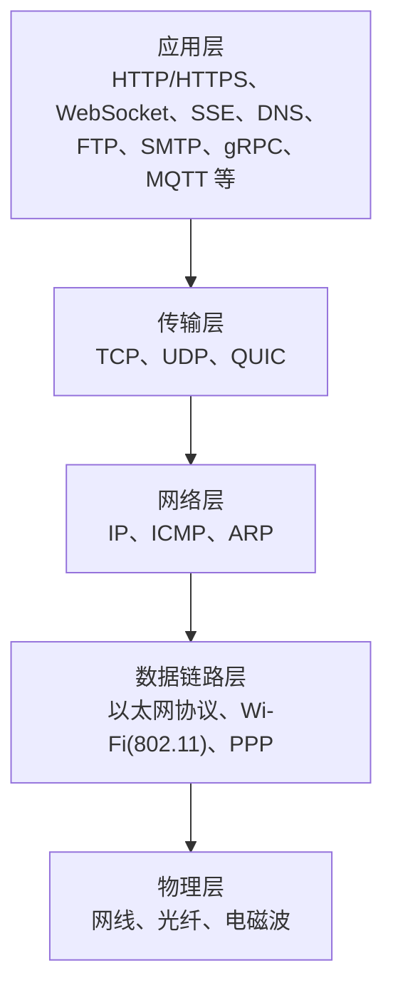

> [!question]
> 众多网络协议，我有点搞不清。
> 
> 只知道http和htpps，tcp，ip这些，其他的像ws是为了实现双向通信，sse是实现流式传输等，我知道，可是却没有实感，以及还有其他的什么RPC远程调用等等。
> 
> 你帮我整个梳理出来，都跟我讲清楚，让我以后听到时心里就知道是干嘛的，回答要详尽具体，可以自底向上等，如果内容太多一次性回答不完，可以考虑分几次回答

# 网络协议全景梳理：从底层到应用层

你这个问题问得非常好——很多人学网络协议都是"听过名字、知道大概",但没有形成体系,导致每次遇到新协议都觉得陌生。我帮你**自底向上**地梳理一遍,让你以后听到任何协议都能立刻在脑子里"定位"它属于哪一层、解决什么问题。

由于内容确实很多,我分**三次**讲完,这样每一部分都能讲透,你也好消化:

- **第一次(本次)**:网络分层模型 + 底层协议(物理层、数据链路层、网络层、传输层)——也就是 IP、TCP、UDP 这些"地基"
- **第二次**:应用层经典协议——HTTP/HTTPS、WebSocket、SSE、DNS、FTP、SMTP 等,以及 HTTP 各版本演进
- **第三次**:现代通信协议——RPC、gRPC、MQTT、WebRTC、QUIC,以及它们的使用场景对比

---

## **一、先建立框架:网络分层模型**

理解所有网络协议的前提,是先有一个"层"的概念。**任何一个协议,都属于某一层,负责某一层的工作。** 这就像快递系统:有人负责造车(物理层)、有人负责开车送货(链路层)、有人负责规划路线(网络层)、有人负责保证货物完整送达(传输层)、有人负责跟收件人对接(应用层)。

业界常用两个模型:

| 模型 | 层数 | 特点 |
|---|---|---|
| OSI 七层模型 | 7 层 | 理论模型,严谨但偏学术 |
| TCP/IP 四层模型 | 4 层 | 工程实践模型,实际使用 |

我们用更直观的**五层混合模型**来讲(把 TCP/IP 的"网络接口层"拆成物理层和数据链路层):

**核心思想**:数据从上往下"打包",每层加一个自己的"头部信息";到了对端再从下往上"拆包",每层读取自己关心的头部。这叫**封装与解封装**。

举个例子:你打开浏览器访问 `www.example.com`,数据流是这样的:

> **应用层**(HTTP 请求) → **传输层**(加 TCP 头,标明端口) → **网络层**(加 IP 头,标明 IP 地址) → **数据链路层**(加 MAC 地址) → **物理层**(变成电信号/光信号传出去)

对方服务器收到后,反过来一层层拆开,最终把 HTTP 请求交给 Web 服务进程。

---

## **二、物理层:信号的传输**

这一层不涉及"协议名词",你只需要知道它负责把**比特流(0 和 1)**变成实际的物理信号——电压高低、光的明暗、电磁波的频率——然后通过网线、光纤、无线电波传出去。

你平时用的 RJ45 网线接口、5G 信号、Wi-Fi 信号,本质都在这一层工作。**不用记协议名,只需知道它的存在。**

---

## **三、数据链路层:同一个局域网内的通信**

这层负责**相邻两台设备之间**的数据传输,比如你的电脑到家里的路由器、路由器到下一跳路由器。

### **关键概念:MAC 地址**

每张网卡出厂时都有一个全球唯一的 **MAC 地址**(48 位,形如 `AA:BB:CC:11:22:33`),它是设备的"身份证"。数据链路层就靠 MAC 地址识别"对方是谁"。

### **关键协议**

- **以太网协议(Ethernet)**:有线局域网最常用的协议,定义了数据帧的格式
- **Wi-Fi(IEEE 802.11)**:无线局域网协议,本质上是"无线版以太网"
- **ARP(地址解析协议)**:**这个一定要记**。它解决的是"我知道对方的 IP,但我怎么知道对方的 MAC?"——ARP 在局域网里广播一句"谁是 IP 192.168.1.1?",对方回应自己的 MAC

**实感**:你在公司插上网线就能上网,背后就是以太网协议在工作;ARP 则像是"在办公室里大喊'张三在哪?'然后张三举手回应"。

---

## **四、网络层:跨网络的路由**

数据链路层只能管"同一个局域网内",但你访问的服务器在地球另一端,中间要经过几十个路由器。**网络层的任务就是规划这条跨网络的路径。**

### **核心协议:IP(Internet Protocol)**

IP 是整个互联网的基石。它给每台设备分配一个 **IP 地址**(IPv4 形如 `192.168.1.1`,IPv6 形如 `2001:db8::1`),并负责把数据包从源 IP 路由到目标 IP。

**IP 协议的两个重要特点**:

1. **无连接**:发出去就不管了,不保证一定到达
2. **不可靠**:数据可能丢、可能乱序、可能重复

听起来很糟糕?别担心,可靠性是上层(TCP)的责任。IP 只负责"尽力而为地送到"。

### **IPv4 vs IPv6**

- **IPv4**:32 位地址,约 43 亿个,早就不够用了
- **IPv6**:128 位地址,数量近乎无限,正在逐步普及

### **配套协议**

- **ICMP(Internet Control Message Protocol)**:网络层的"反馈机制"。你用的 `ping` 命令、`traceroute` 命令,背后就是 ICMP。它负责报告"目标不可达""请求超时"等状态
- **NAT(网络地址转换)**:严格说不是独立协议,而是路由器的功能。它让你家里几十台设备共用一个公网 IP——这也是为什么 IPv4 地址不够用却还能撑到现在

**实感**:IP 协议就像快递的"地址系统",ICMP 就像快递员打电话告诉你"地址有误"或"派送失败"。

---

## **五、传输层:进程到进程的通信(重点!)**

网络层把数据送到了对方机器,但一台机器上跑着几十个程序(浏览器、微信、网易云……),数据该交给哪个程序?**传输层用"端口号"来区分进程**。

这一层有两个核心协议:**TCP** 和 **UDP**,理解它们的区别是整个网络知识的关键。

### **TCP(传输控制协议):可靠的"打电话"**

TCP 的设计目标是**可靠传输**。它做了很多事:

1. **三次握手建立连接**:通信前先确认"你能听到我吗?""我能听到你"
2. **数据分段、按序重组**:大文件拆成小包,到对面再拼回来
3. **确认应答(ACK)**:每个包都要对方回复"收到",没收到就重传
4. **流量控制**:对方处理不过来时,我就发慢一点
5. **拥塞控制**:网络堵了,大家都让一让
6. **四次挥手断开连接**:走的时候也要礼貌告别

**代价**:开销大、延迟高、建立连接慢。

**使用场景**:HTTP/HTTPS、文件下载、邮件、SSH、数据库连接——所有"不能丢一个字节"的场景。

### **UDP(用户数据报协议):不可靠的"发短信"**

UDP 的设计目标是**简单快速**。它几乎什么都不做:

1. **无连接**:不握手,想发就发
2. **不保证送达**:丢了就丢了
3. **不保证顺序**:先发的可能后到
4. **头部极小**:只有 8 字节(TCP 是 20 字节起)

**优势**:延迟极低,适合实时场景。

**使用场景**:DNS 查询、视频会议、在线游戏、直播、物联网——这些场景要么"丢一两个包没关系",要么"重传反而更糟"(比如视频通话,旧的画面重传过来已经没意义了)。

### **TCP vs UDP 对比表**

| 维度 | TCP | UDP |
|---|---|---|
| 连接性 | 面向连接(需握手) | 无连接 |
| 可靠性 | 可靠(保证送达、有序) | 不可靠 |
| 速度 | 较慢 | 极快 |
| 头部开销 | 20 字节起 | 8 字节 |
| 典型应用 | HTTP、SSH、邮件 | DNS、游戏、视频会议 |

### **QUIC:第三种选择(后面细讲)**

近几年崛起的 **QUIC** 协议,跑在 UDP 上但实现了类似 TCP 的可靠性,同时延迟更低。HTTP/3 就是基于 QUIC 的。这个我们第三次细讲。

**实感**:
- TCP 像**挂号信**:每一封都要签收,丢了重寄,顺序送达,但慢
- UDP 像**普通广告传单**:塞进信箱就完事,丢了也不管,但快

---

## **本次小结**

到这里,**底层四层**就讲完了。你现在应该建立起这样的认知:

> 数据在网络上跑,本质是被层层包裹:**物理层**送信号 → **数据链路层**管同网段邻居(MAC 地址) → **网络层**管跨网段路由(IP 地址) → **传输层**管进程通信(端口号 + TCP/UDP 选择可靠性)。

**记住这个核心区分**:
- **IP 解决"机器在哪"**
- **TCP/UDP 解决"机器上的哪个程序,以及通信要不要可靠"**
- **MAC 解决"局域网内具体哪台设备"**

---

下一次(第二部分)我会讲**应用层的经典协议**:HTTP/HTTPS 的请求-响应模型与 HTTP/1.1 到 HTTP/3 的演进、WebSocket 双向通信的真实原理、SSE 流式传输的内部机制、DNS 域名解析、以及 FTP、SMTP 等老牌协议。讲完之后你对你日常用的"网页、聊天、推送"背后的协议会有彻底的"实感"。

准备好了告诉我"继续",我就接着讲第二部分。