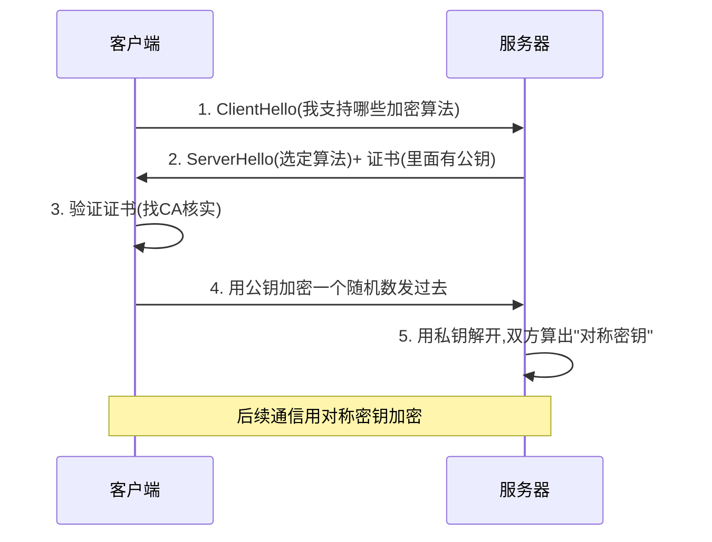

# 第二部分:应用层经典协议详解

好,我们继续。这一部分是你日常**最常接触**的协议层——你打开浏览器、收发邮件、用微信、看直播,背后都是这一层在工作。我会重点讲透 HTTP 家族、WebSocket、SSE 这三个你提到的协议,以及其他几个必知的应用层协议。

---

## **一、应用层是什么?**

应用层是网络协议栈的**最顶层**,直接面向用户程序。它不关心数据怎么传(那是传输层的事),只关心**通信双方说什么、怎么说**——也就是定义"消息的格式和交互规则"。

打个比方:传输层是"邮政系统",负责把信送到;应用层是"信里写什么内容、用什么语言、什么格式"。HTTP 规定信要写成"请求行 + 头部 + 正文",SMTP 规定邮件要写成"发件人/收件人/主题/正文"——它们都是"沟通的语法"。

应用层协议绝大多数跑在 **TCP** 上(因为要可靠),少数跑在 **UDP** 上(比如 DNS、QUIC)。

---

## **二、HTTP:互联网的通用语言**

### **HTTP 的本质**

**HTTP(HyperText Transfer Protocol,超文本传输协议)** 是一种**请求-响应式**的无状态协议。客户端发一个请求,服务器回一个响应,完事。

一次完整的 HTTP 交互长这样:

```
【客户端请求】
GET /index.html HTTP/1.1
Host: www.example.com
User-Agent: Chrome/120.0
Accept: text/html

【服务器响应】
HTTP/1.1 200 OK
Content-Type: text/html
Content-Length: 1234

<html>...</html>
```

**关键特点**:
- **无状态**:服务器默认不记得你上次来过(所以才需要 Cookie/Session/Token 来"记住"你)
- **请求驱动**:必须客户端先发起,服务器不能主动推送(这是 WebSocket 和 SSE 要解决的问题)
- **基于 TCP**:HTTP/1 和 HTTP/2 跑在 TCP 上,HTTP/3 跑在 QUIC(UDP)上

### **HTTP 方法**

| 方法 | 语义 | 是否幂等 |
|---|---|---|
| GET | 获取资源 | 是 |
| POST | 提交数据(常用于创建) | 否 |
| PUT | 替换资源(常用于更新) | 是 |
| DELETE | 删除资源 | 是 |
| PATCH | 部分更新 | 否 |
| HEAD | 只要响应头,不要正文 | 是 |
| OPTIONS | 询问服务器支持什么 | 是 |

"幂等"的意思是:执行一次和执行多次效果一样。GET 请求一万次也只是读取,但 POST 一万次可能创建一万条数据。

### **HTTP 状态码**

记住这个分类法,以后看到任何状态码都能秒懂:

- **1xx**:信息性(很少见)
- **2xx**:成功(200 OK、201 Created、204 No Content)
- **3xx**:重定向(301 永久、302 临时、304 未修改)
- **4xx**:**客户端**错了(400 请求格式错、401 未登录、403 没权限、404 找不到、429 请求太频繁)
- **5xx**:**服务器**崩了(500 内部错误、502 网关错误、503 服务不可用、504 网关超时)

---

## **三、HTTP 版本演进:从 1.0 到 3.0**

这是面试高频考点,也是理解现代 Web 性能的关键。

### **HTTP/1.0(1996)**

每次请求都要新建 TCP 连接,用完关闭。一个网页有 30 个资源(HTML、CSS、JS、图片),就要建 30 次连接——慢得要死。

### **HTTP/1.1(1997,至今仍在使用)**

引入了几个重要改进:

1. **持久连接(Keep-Alive)**:一个 TCP 连接可以发多个请求,默认开启
2. **管道化(Pipelining)**:可以连续发多个请求不用等响应——但有"队头阻塞"问题,实际很少用
3. **Host 头部**:支持一个 IP 上跑多个域名(虚拟主机)
4. **分块传输(Chunked)**:可以边生成边发送数据——**SSE 就是基于这个特性实现的**

**核心痛点**:**队头阻塞(Head-of-Line Blocking)**。即使开了持久连接,同一个连接上的请求也得排队,前一个不回来,后面的就卡着。浏览器只好同时开 6 个 TCP 连接来"并行"——但这是个 workaround。

### **HTTP/2(2015)**

Google 基于自家 SPDY 协议推出,核心革命是**二进制分帧**:

1. **二进制协议**:不再是文本,而是二进制帧(Frame),解析更快
2. **多路复用(Multiplexing)**:一个 TCP 连接上可以**并行**跑多个请求,互不阻塞(应用层的队头阻塞解决了)
3. **头部压缩(HPACK)**:HTTP 头部往往很大且重复,HTTP/2 用 HPACK 算法压缩
4. **服务器推送(Server Push)**:服务器可以主动推送资源(比如客户端请求 HTML,服务器顺便把 CSS 推过来)——不过这个特性后来用得不多,Chrome 已经弃用

**仍然存在的问题**:**TCP 层的队头阻塞**。HTTP/2 解决了应用层的阻塞,但底下还是 TCP——只要一个包丢了,整个 TCP 连接的所有请求都得等重传完成。

### **HTTP/3(2022 标准化)**

为了解决 TCP 的天生缺陷,HTTP/3 直接换底盘——**基于 QUIC(跑在 UDP 上)**:

1. **彻底解决队头阻塞**:QUIC 在 UDP 上实现了多路复用,每个流独立,一个流丢包不影响其他流
2. **连接建立更快**:TCP+TLS 要 3 个 RTT(往返),QUIC 只要 1 个 RTT,甚至 0-RTT
3. **连接迁移**:你从 Wi-Fi 切到 4G,连接不会断(传统 TCP 会断,因为 IP 变了)
4. **强制加密**:QUIC 自带 TLS 1.3,不存在"明文版本"

QUIC 的细节我们第三部分细讲。

### **演进对比表**

| 版本 | 底层 | 多路复用 | 头部压缩 | 队头阻塞 |
|---|---|---|---|---|
| HTTP/1.1 | TCP | 否 | 否 | 应用层 + TCP 层 |
| HTTP/2 | TCP | 是 | HPACK | 仅 TCP 层 |
| HTTP/3 | QUIC(UDP) | 是 | QPACK | 完全消除 |

---

## **四、HTTPS:加了"安全套"的 HTTP**

**HTTPS = HTTP + TLS/SSL**。它不是新协议,而是把 HTTP 跑在加密层(TLS)上。

### **TLS 解决三个问题**

1. **加密**:防止内容被窃听(对称加密传输数据 + 非对称加密交换密钥)
2. **完整性**:防止内容被篡改(消息认证码 MAC)
3. **身份认证**:防止你连到假网站(数字证书 + CA 体系)

### **TLS 握手简化流程**



### **为什么是"对称+非对称"组合?**

- **非对称加密**(RSA、ECDHE)安全但慢,只用来交换"对称密钥"
- **对称加密**(AES)快但要先共享密钥,用来加密实际数据

这就是公私钥的精妙之处:用慢但安全的方式,安全地交换一把快的钥匙。

---

## **五、WebSocket:真正的双向通信**

你提到"WebSocket 是为了实现双向通信"——这话对,但要理解**为什么需要它**,得先明白 HTTP 的局限。

### **HTTP 的痛点:服务器不能主动找你**

HTTP 是**单向请求**的:客户端问,服务器答。如果服务器有新消息要推给客户端(比如聊天、股价、通知),它没法主动发——必须等客户端来问。

历史上有几种"凑合"的方案:

1. **短轮询**:客户端每隔几秒问一次"有新消息吗?"——浪费带宽,延迟高
2. **长轮询(Long Polling)**:客户端发请求后,服务器**hold 住不回**,有消息才回应,然后客户端立即再发一个请求——稍微好点,但每条消息都要建连接
3. **iframe 流、Comet** 等各种 hack——略

这些都治标不治本。直到 **WebSocket(2011 年 RFC 6455)** 出现。

### **WebSocket 的本质**

WebSocket 是一个**全双工、长连接、双向通信**的协议。建立连接后,客户端和服务器**任何一方都能随时发消息**,直到一方主动断开。

### **WebSocket 怎么建立连接?(精妙的设计)**

WebSocket 复用了 HTTP 的握手过程,然后**升级(Upgrade)**为 WebSocket 协议。这样设计是为了:能穿透防火墙、能复用 80/443 端口、能与现有 Web 基础设施兼容。

握手过程:

```
【客户端发起升级请求(本质是一个 HTTP 请求)】
GET /chat HTTP/1.1
Host: server.example.com
Upgrade: websocket
Connection: Upgrade
Sec-WebSocket-Key: dGhlIHNhbXBsZSBub25jZQ==
Sec-WebSocket-Version: 13

【服务器同意升级】
HTTP/1.1 101 Switching Protocols
Upgrade: websocket
Connection: Upgrade
Sec-WebSocket-Accept: s3pPLMBiTxaQ9kYGzzhZRbK+xOo=
```

**101 状态码**(Switching Protocols)就是"切换协议"的意思。握手完成后,这条 TCP 连接就不再说 HTTP 了,改说 WebSocket——后续数据用 WebSocket 的**帧格式**传输,而不是 HTTP 报文。

### **WebSocket 的实感**

想象一下:
- **HTTP**:你给客服打电话,问完一个问题就挂,下次有问题再打。客服不能主动给你打。
- **WebSocket**:你和朋友开着语音通话不挂,谁有话谁说,真正的"双向实时"。

**典型应用**:
- 聊天软件(微信网页版、Slack、Discord)
- 实时协作(腾讯文档、飞书多人编辑、Figma)
- 在线游戏
- 股票行情、加密货币价格推送
- 弹幕系统(B 站直播)

### **协议标识符**

- `ws://`:明文 WebSocket(对应 HTTP)
- `wss://`:加密 WebSocket(对应 HTTPS)

---

## **六、SSE:轻量级的服务器推送**

**SSE(Server-Sent Events,服务器发送事件)** 是另一种服务器推送方案,但和 WebSocket 思路完全不同。

### **SSE 的本质**

SSE 是**单向**的:**只能服务器推给客户端**,客户端不能通过同一连接发数据回去。

它的实现极其优雅——**就是一个永不结束的 HTTP 响应**。利用 HTTP/1.1 的"分块传输(Chunked Transfer Encoding)"特性,服务器把响应"开着不关",有数据就追加发一段。

### **SSE 的数据格式**

```
【客户端请求(就是普通 GET)】
GET /events HTTP/1.1
Accept: text/event-stream

【服务器响应(永不结束)】
HTTP/1.1 200 OK
Content-Type: text/event-stream
Cache-Control: no-cache

data: 第一条消息\n\n

data: 第二条消息\n\n

event: update
data: {"price": 100}\n\n
```

每条消息以 `\n\n` 结束,格式简单到令人发指。浏览器原生支持 `EventSource` API:

```javascript
const es = new EventSource('/events');
es.onmessage = (e) => console.log(e.data);
```

### **SSE 的优势**

1. **基于 HTTP**:不用升级协议,天然兼容代理、CDN、防火墙
2. **协议简单**:就是文本流,调试方便
3. **自动重连**:浏览器内置断线重连机制
4. **天然适合 AI 流式输出**:像 ChatGPT 那种"打字机效果"的响应,大多数都是 SSE 实现的

### **SSE vs WebSocket 对比**

| 维度 | SSE | WebSocket |
|---|---|---|
| 方向 | 服务器 → 客户端(单向) | 双向 |
| 协议 | HTTP(就是普通响应) | 独立协议(从 HTTP 升级) |
| 数据格式 | 仅文本(UTF-8) | 文本 + 二进制 |
| 自动重连 | 浏览器内置 | 需自己实现 |
| 复杂度 | 极低 | 中等 |
| 适用场景 | 通知、推送、AI 流式响应、实时进度 | 聊天、协作、游戏 |

**实感**:
- **SSE** 像**收音机广播**:电台一直播,你打开就能听,你说话电台听不见
- **WebSocket** 像**对讲机**:你和对方都能随时说话

**重要提醒**:你提到 SSE 是"流式传输"——准确地说,SSE 只是流式传输的一种实现方式。**ChatGPT、Claude、Gemini 这类 LLM 的流式响应**几乎都用 SSE,因为它简单、兼容性好,而且 LLM 输出本来就是单向的(服务器吐字给你看)。

---

## **七、其他必知的应用层协议**

### **DNS(域名系统)**

把 `www.example.com` 翻译成 `93.184.216.34` 的"互联网电话簿"。你打开任何网站,第一步都是 DNS 查询。

- 基于 **UDP**(端口 53),因为查询小、要快
- 大数据传输时降级到 TCP
- 现代还有 **DoH(DNS over HTTPS)** 和 **DoT(DNS over TLS)**,加密 DNS 查询,防止运营商劫持

### **FTP(文件传输协议)**

老牌文件传输协议,用两个连接:控制连接(命令)+ 数据连接(文件)。现在大部分被 HTTPS、SFTP(基于 SSH)取代,但内部系统还在用。

### **SMTP / POP3 / IMAP(邮件协议三件套)**

- **SMTP**:发邮件(从你客户端发到服务器,服务器再转发给收件方服务器)
- **POP3**:收邮件(下载到本地后删服务器副本,老式)
- **IMAP**:收邮件(邮件留服务器,多设备同步,现代主流)

### **SSH(Secure Shell)**

远程登录服务器的标准协议,加密通信。你用的 `ssh user@server`、`git push`(SSH 方式)、`scp` 拷贝文件,都是它。

### **Telnet**

SSH 的"前任",明文传输,现在基本不用,但调试网络服务时偶尔有用(比如 `telnet smtp.gmail.com 25` 手动测邮件服务)。

---

## **本次小结**

到这里,**日常 Web 应用层**的核心协议都讲完了。你现在应该明白:

> **HTTP 家族**是 Web 的根基,从 1.1 到 3.0 一直在解决"如何更快地拿到资源"的问题;**HTTPS** 给 HTTP 套上了加密层;**WebSocket** 解决了"服务器主动推送 + 双向通信"的需求;**SSE** 用极简的方式实现了"服务器单向流式推送",特别适合 LLM 这种边生成边输出的场景。

**面试黄金问题**:"WebSocket 和 SSE 怎么选?"
- 只需要服务器推 → SSE(简单可靠,自带重连)
- 需要双向通信 → WebSocket
- AI 流式输出 → SSE(几乎所有大模型 API 都用它)
- 实时聊天 → WebSocket

---

下一次(第三部分,**最终篇**)我会讲:

- **RPC** 是什么?为什么后端开发到处都在说它?
- **gRPC**(Google 出品的现代 RPC)和 HTTP 的关系
- **MQTT**:物联网领域的统治者
- **WebRTC**:浏览器里做视频通话的黑科技
- **QUIC**:HTTP/3 背后的协议,以及为什么大厂都在押注它
- **最终全景图**:所有协议放在一张图上,以及"什么场景用什么协议"的决策树

准备好告诉我"继续",我把最后一部分讲完,你的网络协议知识体系就完整闭环了。