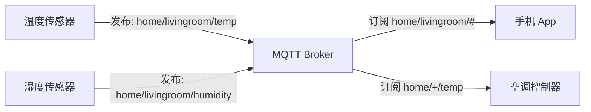
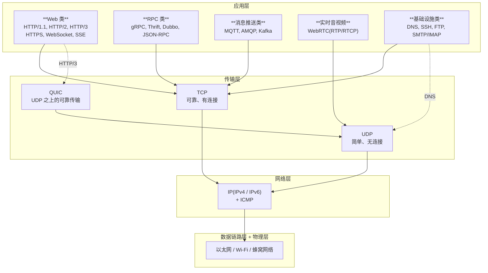

# 第三部分:现代通信协议与全景总结

好,这是最后一部分——也是最"现代"、最贴近当下技术演进的一部分。前两部分讲的协议大多是 90 年代到 2010 年代的产物,而这一部分讲的协议,基本都是**最近 10-15 年崛起**的,代表了今天分布式系统、微服务、物联网、实时音视频的技术现状。

---

## **一、RPC:让远程调用像本地调用一样简单**

### **先理解为什么需要 RPC**

想象你在写一个程序,要调用一个函数:

```python
result = add(1, 2)  # 本地调用,直接返回 3
```

简单吧?但如果这个 `add` 函数不在你机器上,而在另一台服务器上呢?你得:

1. 把参数 `1, 2` 序列化成网络能传的格式(比如 JSON)
2. 通过 HTTP/TCP 发到对方服务器
3. 对方解析参数、执行函数、序列化结果
4. 把结果通过网络发回来
5. 你这边反序列化,拿到 `3`

每次都手写这一堆代码?太痛苦了。**RPC(Remote Procedure Call,远程过程调用)** 就是为了把这些细节**全部封装起来**,让你写远程调用和写本地函数一样简单:

```python
result = rpc_client.add(1, 2)  # 看起来像本地调用,实际上跨网络了
```

### **RPC 不是一个具体协议,而是一种"思想"**

很多人误以为 RPC 是某个特定协议——不是。**RPC 是一种通信模式**,具体实现有很多种:

| RPC 框架 | 出品方 | 传输协议 | 序列化格式 |
|---|---|---|---|
| gRPC | Google | HTTP/2 | Protobuf |
| Thrift | Facebook | TCP | Thrift IDL |
| Dubbo | 阿里 | TCP(自定义) | Hessian/Protobuf 等 |
| JSON-RPC | 开源 | HTTP | JSON |
| XML-RPC | 开源(老) | HTTP | XML |

### **RPC vs REST(HTTP API)的本质区别**

这是个高频疑惑点。两者都能"远程调用",到底区别在哪?

| 维度 | REST(HTTP API) | RPC |
|---|---|---|
| 思维方式 | **面向资源**:URL 代表资源,方法代表操作(GET /users/1) | **面向动作**:URL 代表动作(POST /getUser) |
| 数据格式 | 通常 JSON,文本可读 | 通常二进制(Protobuf),紧凑高效 |
| 协议 | HTTP/1.1 居多 | HTTP/2、TCP 等 |
| 性能 | 一般 | 高(序列化快、体积小) |
| 适用场景 | 对外开放 API、跨语言、跨团队 | 内部微服务调用、高性能场景 |
| 调试 | 浏览器/Postman 直接调 | 需要专门工具 |

**实感**:
- **REST** 像**写信**:"亲爱的服务器,请把 ID=1 的用户信息给我"(URL: GET /users/1)
- **RPC** 像**打电话**:"喂?给我执行 getUser(1)"——直接喊函数名

**典型选择**:
- **对外的开放 API**(比如微信 API、GitHub API)→ REST,通用、跨语言、易调试
- **公司内部微服务之间**(订单服务调用用户服务)→ RPC,性能更好,接口更紧凑

---

## **二、gRPC:Google 出品的现代 RPC 王者**

gRPC 是目前最流行的 RPC 框架,几乎是云原生时代的事实标准(Kubernetes、Istio、etcd 内部都用它)。

### **gRPC 的核心组成**

1. **传输层用 HTTP/2**:复用 HTTP/2 的多路复用、流式传输、头部压缩
2. **序列化用 Protobuf(Protocol Buffers)**:Google 自研的二进制序列化,比 JSON 小 3-10 倍,快 5-100 倍
3. **接口定义用 IDL**:你先写一个 `.proto` 文件描述接口,工具自动生成各种语言的客户端和服务端代码

### **Protobuf 长什么样**

```protobuf
syntax = "proto3";

service UserService {
  rpc GetUser (UserRequest) returns (UserResponse);
}

message UserRequest {
  int32 id = 1;
}

message UserResponse {
  int32 id = 1;
  string name = 2;
  string email = 3;
}
```

写完这个文件,运行 `protoc` 编译器,自动生成 Go、Java、Python、C++、Node.js 等各种语言的代码。客户端直接调 `client.GetUser(...)`,跟本地调用一样。

### **gRPC 的四种通信模式**

这是 gRPC 比 REST 强大的一个重要点——它**天生支持流式传输**(基于 HTTP/2 的流):

1. **Unary(一元)**:客户端发一个,服务器回一个——和普通 REST 类似
2. **Server Streaming(服务器流)**:客户端发一个,服务器**持续返回多个**——类似 SSE
3. **Client Streaming(客户端流)**:客户端**持续发多个**,服务器最后回一个——比如上传大文件分块
4. **Bidirectional Streaming(双向流)**:双方都能持续发——类似 WebSocket

### **gRPC vs WebSocket?**

经常有人问这个。简单说:

- **WebSocket** 是一个**通信通道**,你在上面发什么内容、什么格式,完全自定义
- **gRPC** 是一个**完整的 RPC 框架**,包括了接口定义、代码生成、序列化、传输等全套

可以理解为 WebSocket 是"管道",gRPC 是"管道 + 包装机 + 标签系统"。

### **gRPC 的限制**

- **浏览器原生不支持**:浏览器 JS 没法直接发 HTTP/2 帧,需要 **gRPC-Web** 代理转换
- **调试不友好**:二进制格式,不像 JSON 那样能直接看
- **学习曲线**:要学 Protobuf、要装工具链

所以 gRPC 主要用在**后端微服务之间**,前端基本还是 REST/WebSocket。

---

## **三、QUIC:正在改变互联网底层的协议**

QUIC(Quick UDP Internet Connections)是 Google 在 2012 年开始研发、2021 年被 IETF 标准化为 RFC 9000 的传输层协议。**HTTP/3 就是 HTTP over QUIC**。

### **为什么要有 QUIC?**

TCP 已经用了 40 多年,问题积重难返:

1. **TCP 的队头阻塞**:HTTP/2 解决了应用层的队头阻塞,但 TCP 层只要丢一个包,所有"流"都得等
2. **TCP 握手 + TLS 握手太慢**:TCP 三次握手 + TLS 四次握手,首次连接要 3 个 RTT(往返时间)
3. **TCP 协议固化在操作系统内核**:升级 TCP 要改内核,推广极慢——你电脑上的 TCP 可能是几十年前的实现
4. **IP 切换连接就断**:你从 Wi-Fi 切到 4G,IP 变了,TCP 连接必断,要重新建立

### **QUIC 怎么解决?**

1. **跑在 UDP 上**:UDP 本身简单,QUIC 在用户态(应用层)实现可靠传输——绕过操作系统内核,部署在浏览器和服务器软件里,**升级靠更新浏览器就行**
2. **每个流独立**:多路复用做到了流级别隔离,一个流丢包不影响其他流——**彻底解决队头阻塞**
3. **0-RTT 连接恢复**:第一次连接需要 1-RTT(把 TLS 1.3 握手合并进去),**重连只要 0-RTT**(直接发数据)
4. **连接迁移**:QUIC 用"连接 ID"标识连接,不依赖 IP——Wi-Fi 切 4G,连接不断
5. **强制加密**:协议本身就内置 TLS 1.3,不存在"明文 QUIC"

### **QUIC 的现状**

- **YouTube、Google 搜索、Facebook、Instagram、Cloudflare** 大量使用
- 全球 HTTP/3 流量占比已超过 30%,而且还在快速上升
- 国内 B 站、淘宝、抖音也都在用

### **实感**

如果说 TCP 是"几十年前修的高速公路,改起来很难",QUIC 就是"在 UDP 这块空地上重新设计的现代高速公路系统"——更快、更灵活、更容易升级。

---

## **四、MQTT:物联网的统治者**

**MQTT(Message Queuing Telemetry Transport)** 是一个超轻量的发布-订阅协议,1999 年由 IBM 开发,现在是物联网领域的事实标准。

### **MQTT 的设计目标**

为**带宽受限、电池供电、网络不稳定**的设备设计。想象一个传感器:

- CPU 弱(可能只有几 KB 内存)
- 电池供电(必须省电)
- 用 2G/NB-IoT 网络(带宽小、不稳定)
- 一台中央服务器要管理几十万台这种设备

HTTP 太重了——光一个头部就几百字节,设备根本扛不住。MQTT 头部只要 **2 字节**。

### **发布-订阅模型**

MQTT 不是"客户端-服务器"的请求响应,而是**发布-订阅**:



设备(发布者)把数据发到一个"**主题(Topic)**"上,任何订阅了这个主题的客户端都能收到。设备之间**完全解耦**——发布者不需要知道谁在订阅。

### **QoS 服务质量**

MQTT 提供三种可靠性等级,适应不同场景:

- **QoS 0**:最多发一次,可能丢(类似 UDP)
- **QoS 1**:至少发一次,可能重复
- **QoS 2**:精确发一次,最可靠但最慢

### **MQTT 的典型应用**

- 智能家居(米家、Apple HomeKit 部分场景)
- 工业物联网(传感器、PLC、SCADA 系统)
- 车联网(车辆状态上报)
- 共享单车(GPS 位置上报)
- 手机推送(早期 Facebook Messenger 就用 MQTT 实现推送,据说能省电 50%)

---

## **五、WebRTC:浏览器里的实时音视频引擎**

**WebRTC(Web Real-Time Communication)** 是浏览器和移动应用中实现**点对点(P2P)实时音视频通信**的开放标准。Google 在 2011 年开源,目前是 W3C 和 IETF 标准。

### **WebRTC 解决什么问题?**

视频通话有两个核心挑战:

1. **低延迟**:几百毫秒的延迟就让人受不了(看视频卡 1 秒能忍,通话卡 1 秒就崩)
2. **NAT 穿透**:大多数用户在家用路由器后面,没有公网 IP,两个用户之间怎么直接通信?

### **WebRTC 不是一个协议,而是一组协议**

它实际上是个"协议套餐":

- **媒体传输**:RTP/RTCP(用 UDP,容忍丢包)
- **数据传输**:SCTP over DTLS(可靠的数据通道)
- **NAT 穿透**:STUN、TURN、ICE 协议
- **信令**:**WebRTC 不规定**——你可以用 WebSocket、HTTP、什么都行(信令是用来"互相找到对方"的)

### **NAT 穿透的精妙之处**

两个用户都在 NAT 后面,怎么直接通信?WebRTC 用 **ICE 框架**:

1. **STUN 服务器**:帮你发现"我的公网 IP 和端口是什么"
2. 双方通过信令服务器交换彼此的地址候选
3. 尝试直接打洞连接(成功率约 80%)
4. 实在不行就用 **TURN 服务器**中转(成功率 100%,但要消耗服务器带宽)

### **WebRTC 的实感**

你用过的:
- **Google Meet、腾讯会议、飞书视频、钉钉视频**:几乎全是基于 WebRTC
- **Discord、Whatsapp 网页版语音**
- **在线狼人杀、你画我猜**:数据通道传游戏状态

**WebRTC 也能传任意数据**(`RTCDataChannel`),不只是音视频。所以一些 P2P 文件传输工具(比如 Snapdrop、ShareDrop)也是基于它。

---

## **六、其他值得知道的协议**

### **GraphQL**

严格说不是网络协议,而是一种**API 查询语言**(2015 年 Facebook 开源)。它跑在 HTTP 上,但思想跟 REST 完全不同:

- **REST**:服务器决定返回什么字段
- **GraphQL**:客户端**自己声明**要哪些字段,一次请求拿到精确数据

```graphql
query {
  user(id: 1) {
    name
    email
    posts {
      title
    }
  }
}
```

适合数据复杂、前端需求多变的场景(GitHub API v4 就是 GraphQL)。

### **AMQP / Kafka 协议**

消息队列协议,用于后端服务之间的异步通信。

- **AMQP**:RabbitMQ 用的协议,功能丰富
- **Kafka Protocol**:Kafka 自有协议,为高吞吐量设计

这些主要是后端开发知识,前端基本接触不到。

### **OAuth 2.0 / OpenID Connect**

也不算"传输协议",但是 Web 上**授权和登录**的标准。"用微信登录""用 Google 登录"背后就是 OAuth 2.0。它跑在 HTTPS 上。

---

## **七、协议全景图:把所有协议放到一张图上**



---

## **八、场景决策树:遇到需求该选什么协议?**

这是最实用的一部分,直接对照你的需求选:

### **要做一个普通网站/Web 应用**
→ **HTTP/HTTPS**(HTTP/2 或 HTTP/3 由服务器和浏览器自动协商)

### **要做实时聊天/协作编辑**
→ **WebSocket**(双向、低延迟)

### **要做服务器推送/通知/AI 流式输出**
→ **SSE**(简单、自带重连,推 AI 流首选)

### **后端微服务之间通信**
→ **gRPC**(高性能、强类型、跨语言)
→ 若需要跨团队/对外开放 → **REST API**

### **要做物联网设备通信**
→ **MQTT**(轻量、省电、发布订阅)

### **要做视频会议/语音通话**
→ **WebRTC**(低延迟、P2P、NAT 穿透)

### **要做文件传输**
→ 小文件 → **HTTPS**
→ 大文件、断点续传 → **HTTPS 分块** 或 **专用协议(如 BitTorrent)**

### **要做命令行远程操作服务器**
→ **SSH**

### **要做游戏(MMO、FPS)**
→ **UDP** 自定义协议(对延迟敏感、容忍丢包),少数用 **TCP** 或 **WebSocket**

### **要做股票行情/币圈行情推送**
→ **WebSocket**(双向、可订阅可取消)

---

## **九、最后:从"听过名字"到"心里有谱"**

走完这三部分,你应该已经建立起这样的认知:

> **底层协议(IP/TCP/UDP)**像物流体系,**应用层协议**像不同的"业务规范"——HTTP 是请求-响应,WebSocket 是双向常驻,SSE 是单向广播,RPC 是远程函数调用,MQTT 是发布订阅,WebRTC 是 P2P 实时,QUIC 是新一代传输底盘。

**给你一个记忆口诀**(按"通信方向"分类):

- **客户端拉(请求-响应)**:HTTP/HTTPS、REST、gRPC(Unary)
- **服务器推(单向)**:SSE、Server Push、MQTT 订阅
- **双向实时**:WebSocket、gRPC 双向流、WebRTC
- **设备解耦**:MQTT、Kafka、AMQP
- **底层加速**:QUIC、HTTP/3

以后你听到任何协议,先在脑子里问三个问题:

1. **它在哪一层?**(传输层 / 应用层)
2. **它解决什么核心问题?**(可靠传输?双向通信?低延迟?省电?)
3. **它跟我已经熟悉的协议有什么区别?**(跟 HTTP 比?跟 TCP 比?)

这三个问题问完,任何陌生协议都能在你的知识体系里找到位置。

---

到这里,网络协议的整体梳理就完整了。从物理层的电信号,到数据链路层的 MAC,到网络层的 IP,到传输层的 TCP/UDP/QUIC,再到应用层的 HTTP 家族、WebSocket、SSE、RPC、MQTT、WebRTC——你现在有了一张完整的地图。

以后无论是看技术文章、面试、做架构设计,你都能从"听过名字"升级到"心里有谱、知道它干嘛、能跟其他协议对比"。这才是真正的"实感"。