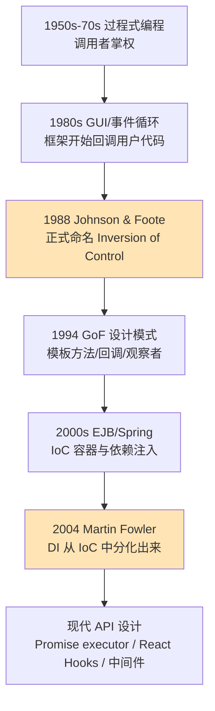

> [!question]-
> ```js
> const resolve = (v) => {
>     if (this.state === 'pending') {
>         this.state = 'fulfilled'
>         this.value = v
>         this.callbacksFulfilled.forEach(fn => queueMicrotask(() => fn(v)))
>     }
> }
> const reject = (e) => {
>     this.state = 'rejected'
>     this.value = e
>     this.callbacksRejected.forEach(fn => queueMicrotask(() => fn(e)))
> }
> try {
>     executor(resolve,reject);
> } catch (e) {
>     reject(e);
> }
> ```
> 
> 这里，executor本是自定义函数，但是构造函数里强行把定义好的resolve和reject塞给它，导致executor看起来是自定义，但是参数是固定的，参数已经被决定了，executor必须围绕这两个参数行动。
> 
> 这种控制反转的思想应该不是promise出来的，它最开始是怎么出现的，怎么发展的，给我具体说一下，可以结合历史，总之务必让我通透

### **控制反转（IoC）的思想最早可追溯到 1980 年代的框架设计实践，由 Ralph E. Johnson 与 Brian Foote 在 1988 年的论文《Designing Reusable Classes》中首次系统化阐述为"Hollywood Principle（好莱坞原则）—— Don't call us, we'll call you"，后经 Martin Fowler 在 2004 年进一步细化为"依赖注入"等具体形态，Promise 的 executor 模式只是这种思想在异步编程领域的一次典型应用。**

你这段代码看得非常透彻，已经摸到了一个软件工程史上极其重要的命门——**谁掌握主动权（who is in control）**。我顺着你的直觉，把这条思想脉络从头给你捋一遍，让你看到 Promise 的 executor 只是这棵大树上的一片叶子。

## **一、最朴素的程序：调用者掌权**

在最早期的程序设计里（1950s\~1970s 的过程式编程），程序的控制流非常直白：

```c
int main() {
    int x = read_input();
    int y = compute(x);
    print(y);
}
```

**主程序是绝对的指挥官**。它决定何时调用 `read_input`、何时调用 `compute`、何时调用 `print`。被调用的函数是"工具"，它们被动地等待被使用。这种模式叫 **正向控制流（Normal Control Flow）**：你的代码调用库（library）。

库（library）的特征就是：**你调用它，它给你返回结果**。比如 `Math.sqrt(4)`，你主动找它。

## **二、GUI 时代的冲击：事件循环的诞生（1980s）**

转折点出现在图形用户界面（GUI）的兴起。Smalltalk-80、早期 Macintosh Toolbox、Microsoft Windows 1.0（1985）这些系统遇到了一个新问题：

**用户什么时候点鼠标？什么时候敲键盘？程序员根本不知道。**

如果还按老办法写：

```
while (true) {
    if (鼠标点了) 处理点击();
    if (键盘按了) 处理键盘();
    ...
}
```

那每个程序员都要自己写一个事件循环，重复造轮子，而且容易写错。于是操作系统/GUI 框架开始提供 **事件循环** 自己跑，开发者只需要：

```c
// Windows 早期 API 风格
RegisterWindowProc(MyWindowProc);  // 把我的函数交给系统
RunMessageLoop();                   // 系统跑起来
```

注意发生了什么：**你不再调用框架，框架反过来调用你**。你写的 `MyWindowProc` 不是你自己调的，是 Windows 在合适的时机调的。

这就是 **控制反转** 第一次大规模出现在工业界。它有了一个非常生动的名字：

> **Hollywood Principle: "Don't call us, we'll call you."**
> （别打给我们，我们会打给你 —— 来自好莱坞经纪人对待龙套演员的标志性台词）

## **三、学术界的命名：1988 年 Johnson & Foote**

这种"框架反过来调用用户代码"的现象，在 1980 年代末被学术界正式总结。

Ralph Johnson（"四人帮"GoF 之一）和 Brian Foote 在 1988 年发表的经典论文 **《Designing Reusable Classes》** 里明确指出：

> "One important characteristic of a framework is that the methods defined by the user to tailor the framework will often be called from within the framework itself, rather than from the user's application code. The framework often plays the role of the main program in coordinating and sequencing application activity. **This inversion of control** gives frameworks the power to serve as extensible skeletons."

**这是"Inversion of Control"这个术语的学术起点。** 他们同时给出了 **库（Library）** 和 **框架（Framework）** 的本质区别：

| 维度 | Library（库） | Framework（框架） |
|---|---|---|
| 谁调用谁 | 你调用它 | 它调用你 |
| 主动权 | 在你手里 | 在框架手里 |
| 你写的代码角色 | 主程序 | 被插入的零件（钩子） |
| 类比 | 你去超市买东西 | 你去面试，HR 让你做什么你做什么 |

## **四、设计模式时代：模板方法、回调、观察者（1990s）**

1994 年 GoF 的《Design Patterns》出版，里面好几个模式本质上都是 IoC 的不同表现形式：

**模板方法模式（Template Method）**：父类定义骨架，子类填充钩子。

```java
abstract class Game {
    public final void play() {   // 父类掌握流程
        initialize();
        startPlay();
        endPlay();
    }
    abstract void initialize();   // 子类只能"被调用"
    abstract void startPlay();
    abstract void endPlay();
}
```

**回调函数（Callback）**：你把函数交出去，由别人决定何时调用。

```c
qsort(arr, n, sizeof(int), my_compare);  // my_compare 由 qsort 内部调用
```

**观察者模式（Observer）**：你订阅，事件来了它通知你。

这些都是同一个思想的不同包装：**把"何时执行"这个决定权交给别人**。

## **五、企业级框架的爆发：EJB 与 Spring（2000s）**

2000 年代初，Java 企业开发陷入 EJB 的泥潭——配置极其复杂，对象的创建、依赖关系、生命周期全都要由容器管理。开发者写的 Bean，是被容器在合适的时机实例化、注入依赖、调用方法。

2003 年，Rod Johnson 推出 **Spring Framework**，把 IoC 容器做成了核心卖点。但当时大家对 IoC 这个词的理解很混乱，有人说它就是依赖注入，有人说它是回调。

**2004 年，Martin Fowler 写下了那篇里程碑文章 [《Inversion of Control Containers and the Dependency Injection pattern》](https://martinfowler.com/articles/injection.html)**，做了一件极其重要的事：他指出 IoC 是一个太宽泛的概念（**任何框架都"反转"了控制**），所以他造了一个更精确的术语 —— **Dependency Injection（依赖注入，DI）** ，来专指"把依赖对象交给容器去构造和注入"这种特定形式的 IoC。

从此以后：
- **IoC** 是大伞，指任何"框架调用你"的模式。
- **DI** 是 IoC 的一种具体实现，专指依赖对象的注入。
- **回调、事件、模板方法、Promise 的 executor**，全都是 IoC 家族的不同分支。

## **六、回到你的 Promise executor**

现在再看你贴的那段代码：

```js
new Promise((resolve, reject) => {
    // 你写的逻辑
    setTimeout(() => resolve(42), 1000);
});
```

发生了什么？

1. **你定义了 executor**，但你没调用它。
2. **Promise 构造函数调用了它**，并且**强行把 Promise 内部的 resolve / reject 注入给你**。
3. 你的 executor 只能围绕这两个被注入的参数工作。

这完美对应 IoC 的两个核心特征：
- **谁调用：** Promise 调用 executor（Hollywood Principle）。
- **谁提供依赖：** Promise 把 resolve/reject 注入给 executor（Dependency Injection 的味道）。

为什么要这样设计？因为 `resolve` 和 `reject` 必须能修改 **Promise 实例内部的 state、value、callbacks**。如果让用户自己创建 resolve，用户就拿不到这些私有状态；如果暴露 setState 之类的方法，用户就可以反复修改状态，破坏 Promise "状态一旦确定不可变" 的契约。

**Promise 通过 IoC，把"改变状态的能力"以受控的、一次性的形式注入给用户**，既给了用户表达异步逻辑的自由，又保住了状态机的不可侵犯。这是 IoC 在 API 设计层面一次教科书级的运用。

## **七、思想脉络一图流**



## **八、给你的"通透感"一击**

如果你只记一句话，记这句：

> **IoC 的本质，是"谁掌握执行的时机和上下文"这个权力，从用户代码移交给框架。**

- 你写函数，不代表你拥有它的执行权。
- 框架愿意接管执行权，是因为它能在更合适的时机、更安全的上下文中调用它。
- 用户少了自由，但换来了更强的契约保证（比如 Promise 的状态不可逆）。
- 这是软件工程对"自由 vs 秩序"这个永恒命题的一种回答。

Promise 的 executor 不是发明家，它只是这个思想链条上一个非常优雅的继承者。从 Windows 的消息循环、到 Smalltalk 的 MVC、到 Spring 的 BeanFactory、到 React 的渲染调度、到 Koa 的洋葱中间件——你只要看到"我写的代码不是我自己调的"，背后基本都站着 IoC 这个老祖宗。

理解了这点，你以后看任何框架源码，都会先问一个关键问题：**这里到底是谁在调谁？** 一旦答案是"框架在调我"，你就立刻明白：哦，又是控制反转，那我要找的就是它注入给我的那几个参数，以及它期待我返回什么。整个框架的脉络瞬间就清晰了。