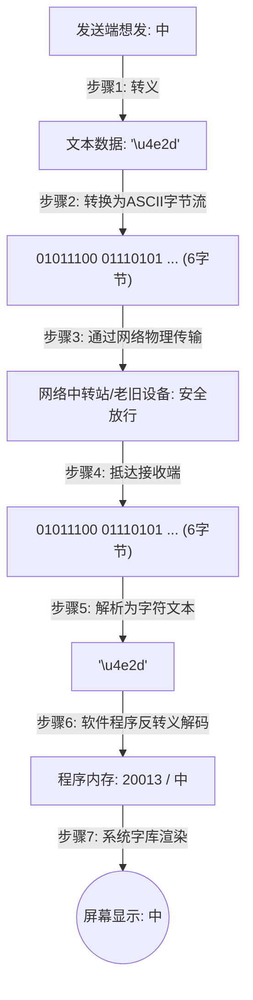

# 计算机字符表示与传输转义机制笔记

本篇笔记系统梳理了字符在计算机中从**逻辑字典、二进制存储、网络传输**到**最终渲染**的全流程机制，帮助彻底厘清 Unicode、UTF-8 编码、转义（Escape）之间的区别与联系。

---

## 一、 核心概念对比

在计算机处理文本的过程中，存在四个核心概念层：

| 概念 | 形象比喻 | 作用 | 示例（以“中”为例） |
| :--- | :--- | :--- | :--- |
| **字符 (Character)** | 人类看到的汉字 | 信息的基本语义单元 | `中` |
| **字符集/字典 (Unicode)** | 全球通用的“大字典” | 为世界上每一个字符分配一个唯一的数字编号（码点） | `20013` (十六进制：`4e2d`) |
| **字符编码 (UTF-8 / UTF-16)** | 页码写在纸上的“排版规则” | 决定逻辑编号如何转成一串 `0101` 的二进制字节在硬盘上存储 | `11100100 10111000 10101101` (UTF-8 编码) |
| **转义表示 (Escaping)** | 传递英文电报时的“临时暗号” | 用一组纯英文字符/符号的组合，安全地替代可能发生冲突或不兼容的字符 | `\u4e2d` (由 6 个 ASCII 字符物理组成) |

---

## 二、 深度解析：UTF-8 的二进制切分与自同步设计

中英文混合时，计算机读取一串连在一起的 `0101` 二进制流，是如何知道“哪几个字节代表一个汉字，哪一个字节代表一个英文字母”的？

这就是 **UTF-8 变长编码**的精妙设计：它通过**高位标志位（字节前缀）**来唯一确定切分界限。

### 1. UTF-8 的模板规则

| 字符范围 | 字符类型 | UTF-8 字节模板（二进制） | 说明 |
| :--- | :--- | :--- | :--- |
| `0 - 127` | 英文字母/数字/基础符号 | `0xxxxxxx` (占 1 字节) | 首位是 `0`，与 ASCII 完全兼容 |
| `128 - 2047` | 希腊文、阿拉伯文等 | `110xxxxx 10xxxxxx` (占 2 字节) | 首字节以 `110` 开头 |
| `2048 - 65535` | 绝大多数常用汉字 | `1110xxxx 10xxxxxx 10xxxxxx` (占 3 字节) | 首字节以 `1110` 开头，后跟两个 `10` 开头的字节 |
| `65536 - 2097151` | 表情符号 (Emoji)、冷僻字 | `11110xxx 10xxxxxx 10xxxxxx 10xxxxxx` (占 4 字节) | 首字节以 `11110` 开头 |

### 2. 实战演练：“中”字的 UTF-8 转换计算
汉字“中”在 Unicode 字典中的编号（十六进制）为 `4E2D`，转为 16 位二进制是：`0100 1110 0010 1101`。

由于 `4E2D` 的数值介于 2048 至 65535 之间，套用 **3 字节模板**：
$$\text{模板：} 1110\color{red}{xxxx}\ 10\color{green}{xxxxxx}\ 10\color{blue}{xxxxxx}$$

将 `0100 1110 0010 1101` 从右往左拆分并依次填入 `x`：
* 末尾 6 位 `101101` 填入第三字节：`10` + `101101` = `10101101` (十六进制：`AD`)
* 中间 6 位 `111000` 填入第二字节：`10` + `111000` = `10111000` (十六进制：`B8`)
* 开头 4 位 `0100` 填入第一字节：`1110` + `0100` = `11100100` (十六进制：`E4`)

**最终得到的 UTF-8 存储数据：** `E4 B8 AD`（二进制：`11100100 10111000 10101101`）。

> [!TIP]
> **读取过程**：计算机读取时，一旦看到一个字节以 `1110` 开头，就知道这代表一个“3字节汉字”的起点，它会自动连同后面两个以 `10` 开头的字节整体切下来，拼出字典编号 `4E2D`，去字库里渲染出“中”字。

---

## 三、 传输乱码与“转义”的深层意义

### 1. 为什么直接发送“中”字（UTF-8）中途可能变乱码？
在网络协议或老旧系统中，有些网络节点或数据库字段是为 **7-bit ASCII** 协议设计的。它们强制要求**每个字节的最高位（最左边一位）必须是 `0`**。

* **直接发“中”** 的字节是 `11100100` (E4) 等。它们的最高位是 `1`。
* 当经过只支持 7-bit 的老旧中转站时，中转站会**强行把最高位的 `1` 改写为 `0`**（例如把 `11100100` 改为 `01100100`，即英文字母 `d`）。
* **结果**：二进制数据被物理破坏，接收端收到了垃圾数据，自然解码不出“中”字，变成**乱码**。

### 2. 变成 `\u4e2d` 是如何解决这个问题的？
转义的核心逻辑是：**用“多花空间”的代价换取“绝对的兼容与安全”。**

当我们把“中”转义为 `\u4e2d` 时，在物理线路上发送的实际上是 **6 个英文字符和符号**：
1. `\` (ASCII: `01011100`) —— 最高位为 `0`
2. `u` (ASCII: `01110101`) —— 最高位为 `0`
3. `4` (ASCII: `00110100`) —— 最高位为 `0`
4. `e` (ASCII: `01100101`) —— 最高位为 `0`
5. `2` (ASCII: `00110010`) —— 最高位为 `0`
6. `d` (ASCII: `01100100`) —— 最高位为 `0`

**网络中转站的反应**：“这全是标准英文字符，没有生僻数据，完全放行！”

**数据流向的全流程图解：**

---

## 四、 为什么文本编辑器打开时显示 `\u4e2d` 而不是 “中”？

既然可以通过翻译渲染，那为什么在你的编辑器里打开有些文件时显示的直接是 `\u4e2d`？

这取决于**软件的定位**：

1. **运行中的应用软件（如网页、App）**：它们有内置的 **JSON 解析引擎** 或**文本解析器**。它们读取文件内容时，会自动执行上面的“步骤 6 (反转义)”，所以你看到的是中文。
2. **纯文本编辑器（如记事本、原始终端）**：它们的职责是**“文件里存的是什么字节，我就在屏幕上画什么字符”**。
   * 如果文件物理存储的是 `E4 B8 AD` (UTF-8 字符)，编辑器就渲染出 `中`。
   * 如果文件物理存储的是 `\`、`u`、`4`、`e`、`2`、`d`，编辑器就老老实实画出这 6 个字符 `\u4e2d`。它不会自作聪明地去帮你执行“翻译”。
