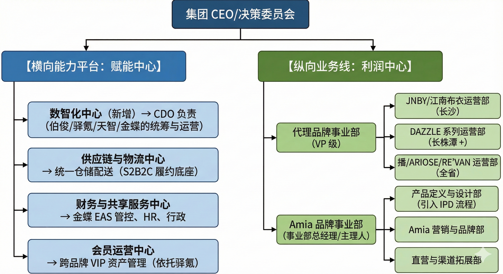

# 集团战略转型深度研究报告：构建“双引擎”驱动的数智化时尚零售集团

## 摘要

本报告旨在为公司即将召开的战略会议提供全面、深度的决策依据。基于公司当前的数字化基础（驿氪CRM、伯俊ERP/POS、金蝶EAS、天智BI）及多元化的业务版图（代理JNBY、DAZZLE等一线品牌与自创品牌Amia），本报告提出了一项系统性的**“数智化组织进化与架构重塑”**战略。

面对时尚零售行业的剧烈变革，传统的“代理商思维”已无法支撑公司向“品牌管理集团”的跃升。报告借鉴**理想汽车的矩阵式组织与IPD集成产品开发体系**、**小米的“铁人三项”高效率模型**以及**SHEIN的敏捷供应链**经验，论证了公司实施组织变革的必要性。核心建议包括：构建连接前后台的**“数据中台”**以打通伯俊、驿氪与金蝶的数据孤岛；组建具备业务洞察力的**数智化团队**；推行**矩阵式组织架构**以平衡代理业务的“效率”与自创品牌的“创新”；并引入**S2B2C**模式赋能加盟商与终端门店。

本报告共分八个章节，深入剖析了从技术架构到底层逻辑、从岗位能力到考核激励的全方位转型路径，旨在助力公司在湖南乃至全国市场构建不可复制的数智化核心竞争力。

---

## 第一章 战略背景与现状诊断：从“信息化”迈向“数智化”

### 1.1 战略转折点：双引擎业务模式的内在张力

公司目前处于独特的战略混合期，同时运营着两套截然不同逻辑的业务引擎，这种“双引擎”结构既是优势也是挑战。

1. **现金流引擎（代理业务）：**
   
    - **业务构成：** 涵盖JNBY（长沙）、DIAMOND DAZZLE（长沙）、DAZZLE（长株潭及部分市县）、d'zzit（全省）、播（全省）、ARIOSE（全省）、RE'VAN等强势品牌。
      
    - **核心逻辑：** **区域渗透与运营效率**。作为区域代理商，品牌资产属于品牌方，公司的核心价值在于对湖南市场的深度覆盖、VIP客户的精细化运营以及库存的高效周转。这要求组织具备极致的执行力和渠道管控力，类似于**小米的“新零售”高效率模型** 。
      
    - **痛点：** 随着品牌方DTC（直面消费者）策略的加强，代理商若无法提供超越单纯“卖货”的数字化用户价值，将面临被去中介化的风险。
    
2. **增长引擎（自创品牌Amia）：**
   
    - **业务构成：** 4个直营店，2个加盟店，处于孵化与验证期。
      
    - **核心逻辑：** **产品创新与品牌资产沉淀**。这要求具备从用户需求洞察到产品定义的闭环能力，类似于**理想汽车的“产品经理思维”与IPD（集成产品开发）体系** 。
      
    - **痛点：** 目前规模尚小，若沿用代理业务的“订货-销售”逻辑，缺乏从设计端介入的敏捷反应机制，极易陷入库存积压或同质化竞争。
      

### 1.2 IT基础设施诊断：数据孤岛下的效能瓶颈

公司已上线四大核心系统，构筑了坚实的信息化底座。然而，对标行业领先的“数智化”标准，目前系统间仍存在割裂，导致数据无法实时转化为决策智能 。

| **系统名称**      | **核心职能（现状）**                             | **战略缺口与数智化升级方向**                                                                                                                                                        |
| ------------- | ---------------------------------------- | ----------------------------------------------------------------------------------------------------------------------------------------------------------------------- |
| **伯俊ERP与POS** | **“躯干”：** 管理商品主数据、进销存流转、门店收银。是目前业务流转的中枢。 | **缺口：** 往往仅作为记录工具，缺乏实时库存共享能力。JNBY长沙的库存无法实时被d'zzit全省的VIP看到，阻碍了全渠道（Omni-channel）销售。      **升级方向：** 打造**“实时库存中心”**，实现多品牌、多仓、多店库存的一盘棋管理，支撑“云仓”销售 7。             |
| **驿氪CRM**     | **“心脏”：** 管理会员资产、积分、优惠券及微信生态（私域流量）。      | **缺口：** 侧重于营销互动（发券、通知），与ERP的交易数据（买了什么、退货率）未深度打通，难以计算单客净毛利（CLV）。      **升级方向：** 结合天智BI，建立**“动态用户画像”**，不仅知道客户是谁，还能预测她下一季的需求 。                                 |
| **金蝶EAS财务**   | **“钱包”：** 总账管理、应收应付、税务合规。                | **缺口：** 数据滞后（月结思维），难以支撑“日利润”管理。业务数据与财务数据往往需要人工对账。      **升级方向：** 实现**“业财一体化”**，每一笔POS交易自动生成凭证，实时核算各品牌、各店铺的盈亏平衡点 。                                           |
| **天智BI系统**    | **“大脑”：** 数据可视化报表。                       | **缺口：** 目前多为描述性分析（Descriptive Analytics，发生了什么），缺乏预测性分析（Predictive Analytics，将要发生什么）。      **升级方向：** 引入AI算法模型，从“看报表”转向**“智能预警”**（如：自动提示某款SKU在株洲滞销，建议调拨至长沙） 。 |

**诊断结论：** 公司不缺系统，缺的是连接系统的**“数据中台”**思维和能够驾驭这些数据的**“数智化团队”**。战略重心应从“系统上线”转向“数据运营”。

---

## 第二章 组织架构重塑：引入“矩阵式”管理模型

为了解决“代理业务追求效率”与“自创品牌追求创新”的矛盾，建议引入**理想汽车**和**华为**验证成功的**矩阵式组织架构（Matrix Organization）** 。

### 2.1 矩阵式架构设计理念

矩阵式架构通过“横向平台”与“纵向业务线”的交织，实现资源的最大化共享与业务的专业化聚焦。

- **纵向（业务线）：** 负责打仗，背负P&L（损益）指标，以GMV、利润、市场份额为考核核心。
  
- **横向（能力平台）：** 负责输送弹药，建设标准化能力（如供应链、数字化、财务、HR），以服务质量、响应速度、技术领先性为考核核心。
  

### 2.2 公司目标组织架构图谱

### 2.3 关键职能解析

#### 2.3.1 代理品牌事业部：S2B2C模式的高效执行者

- **核心职能：** 聚焦于零售终端的**“人、货、场”**精细化管理。
  
- **变革点：** 从“管货”转向“管人”。利用驿氪CRM数据，赋能导购进行“千人千面”的精准营销。对于DAZZLE等覆盖长株潭及部分市县的品牌，需建立**跨区域的智能调拨机制**，利用伯俊系统实现货品在不同城市间的高效流转，最大化售罄率 。
  

#### 2.3.2 Amia品牌事业部：IPD模式的创新试验田

- **核心职能：** 全权负责Amia品牌的生命周期管理，从用户需求洞察到产品上市。
  
- **变革点：** 引入**产品经理（Product Manager）**角色，而非单纯的设计师。借鉴理想汽车的**IPD（集成产品开发）**理念，设计不是“画图”，而是基于数据（天智BI提供的历史销售趋势）和用户反馈（驿氪CRM的试穿数据）进行的“产品定义” 。
  

#### 2.3.3 数智化中心：连接全域的大脑

- **核心职能：** 不再是传统的IT部门（修电脑/维护网络），而是**业务变革的驱动者**。负责构建数据中台，清洗并标准化四大系统的数据，为业务线提供决策依据。
  

---

## 第三章 数智化团队组建方案：角色、能力与招聘

数智化转型的成败在于“人”。公司需要一支既懂零售业务、又懂数据技术的混合型团队。

### 3.1 团队核心领导：首席数字官 (CDO)

**岗位定位：** 集团副总裁级，直接向CEO汇报。不同于CIO（首席信息官）关注系统稳定性，CDO关注利用数字技术创造商业价值 。

- **核心职责：**
  
    1. **顶层设计：** 制定集团数字化战略，打通伯俊、驿氪、金蝶、天智的数据壁垒。
       
    2. **业务融合：** 推动“业务数据化”（将线下行为线上化）和“数据业务化”（利用数据指导Amia设计和JNBY订货）。
       
    3. **变革管理：** 克服组织内部对新工具（如移动端BI、导购任务系统）的抵触情绪。
    
- **能力要求：**
  
    - **背景：** 10年以上零售或互联网行业经验，有大型ERP/CRM实施及数据中台建设经验。
      
    - **硬技能：** 精通全渠道零售逻辑（O2O）、S2B2C模式架构、数据治理（Data Governance）。
      
    - **软技能：** 极强的跨部门沟通能力、战略视野、商业敏锐度。
      

### 3.2 数智化团队架构与关键岗位

建议数智化团队编制为8-12人，分为三个功能小组：**数据智能组**、**产品应用组**、**系统运维组**。

#### A. 数据智能组 (The "Brain")

负责天智BI系统的深度应用与算法模型构建。

- **岗位1：商业数据分析专家 (Business Intelligence Specialist)**
  
    - **职责：** 利用天智BI，建立各品牌的**“经营驾驶舱”**。深入分析JNBY（长沙）与d'zzit（全省）的用户画像差异，为订货会提供数据支持。开发库存预警模型（如：库存周转率低于X则自动报警）。
      
    - **能力要求：** 精通SQL、Python、Tableau/PowerBI/天智；熟悉零售数学（售罄率、连带率、GMROI）；具备“讲故事”的数据呈现能力。
      
    - **Benchmark：** 对标SHEIN的数据分析师，能通过销售数据反推流行趋势 。
    
- **岗位2：主数据管理专员 (Master Data Specialist)**
  
    - **职责：** 负责伯俊ERP中SKU主数据、驿氪CRM中会员标签、金蝶EAS中财务科目的**标准化与映射**。确保“一条裙子”在三个系统中是同一个ID。这是数智化的基石 。
      
    - **能力要求：** 严谨细致，熟悉数据库逻辑，有ERP主数据维护经验。
      

#### B. 产品应用组 (The "Hands")

负责驿氪CRM与伯俊POS的前端应用与用户体验优化。

- **岗位3：新零售产品经理 (Digital Product Manager)**
  
    - **职责：** 负责驿氪CRM小程序及导购端APP的功能迭代。设计基于微信生态的**“私域流量”**玩法（如Amia新品试穿预约、JNBY会员积分兑换）。将业务需求转化为IT需求 。
      
    - **能力要求：** 懂私域运营、熟悉微信生态规则、具备原型设计能力（Axure/Sketch）、具备敏捷开发管理能力。
      
    - **Benchmark：** 对标瑞幸咖啡或奈雪的茶的用户增长产品经理。
    
- **岗位4：用户运营专家 (User Operations Specialist)**
  
    - **职责：** 利用驿氪CRM进行精细化人群包划分（Segmentation）。设计自动化营销链路（Marketing Automation），例如：针对“购买过DAZZLE但未购买过Amia”的长沙VIP，自动推送Amia的体验券。
      
    - **能力要求：** 数据敏感度高，擅长A/B测试，熟悉会员生命周期管理（LTV）。
      

#### C. 系统运维组 (The "Foundation")

负责保障四大系统的稳定性与接口通畅。

- **岗位5：系统架构师/ERP专家**
  
    - **职责：** 负责伯俊ERP与周边系统（金蝶、驿氪）的API接口管理。确保大促期间（双11、618）系统的高可用性。
      
    - **能力要求：** 深入理解伯俊BOS架构、金蝶EAS接口规范；具备云服务器（阿里云/腾讯云）管理能力 。
      

---

## 第四章 组织职能构建：基于“数据中台”的业务流重构

单纯的人员招聘不够，必须重构基于数据的业务流程。以下针对核心业务场景进行职能重构。

### 4.1 场景一：智能商品运营（针对代理品牌）

- **现状：** 依靠经验进行商品调拨，往往滞后。
  
- **重构后职能：**
  
    - **数智化中心：** 每周一自动生成《全省库存效能诊断报告》，通过天智BI推送至各品牌经理手机。系统自动计算“长沙JNBY溢出库存”与“株洲潜在需求”的匹配度。
      
    - **代理事业部：** 品牌经理依据数据建议，在伯俊系统中一键确认调拨单。
      
    - **价值点：** 提升售罄率，降低季末库存压力，实现**“货找人”**。
      

### 4.2 场景二：IPD集成产品开发（针对Amia品牌）

- **现状：** 设计师凭感觉画图，甚至“拍脑袋”定款。
  
- **重构后职能（引入IPD流程）：**
  
    - **市场洞察（CDO团队支持）：** 数智化团队从驿氪CRM中提取Amia及竞品（如JNBY、DAZZLE）用户的偏好标签（颜色、廓形、价格带），形成《季度产品规划书》的数据底座 。
      
    - **产品定义（Amia主理人）：** 基于数据定义SKU宽度（款数）和深度（件数），而非仅仅基于审美。
      
    - **敏捷快反（供应链中心）：** 利用SHEIN式的“小单快返”模式。先在4家直营店上架小批量新款，通过伯俊POS实时监控试穿率（驿氪RFID支持）和转化率。数据好的款，立即在金蝶中追加预算，通知工厂翻单；数据差的款，立即停止生产 。
      

### 4.3 场景三：全域会员资产变现（S2B2C赋能）

- **现状：** 导购离职带走客户，加盟商缺乏会员运营能力。
  
- **重构后职能：**
  
    - **集团层面（S）：** 数智化中心统一生产数字化内容（Amia穿搭海报、短视频），通过驿氪系统下发给全省导购和加盟商。
      
    - **终端层面（B）：** 导购/加盟商一键转发至朋友圈或VIP一对一推送。
      
    - **消费者层面（C）：** 顾客点击链接购买（即使店里没货，也可通过伯俊云仓发货），业绩归属该导购/加盟商。
      
    - **价值点：** 解决Amia加盟店库存有限的问题，利用集团大库存做生意，实现 **“一盘货卖全省”** 。
      

---

## 第五章 实施路径图：从基础整合到智能决策

鉴于公司目前已有多套系统，转型的关键在于**连接**。

### 第一阶段：数据治理与底座夯实（1-6个月）

- **目标：** 消除数据孤岛，建立统一的数据标准。
  
- **关键动作：**
  
    1. **主数据清洗：** 统一四大系统中的商品编码、门店编码、会员ID。确保金蝶中的财务口径与伯俊中的业务口径一致。
       
    2. **API打通：** 实现伯俊ERP库存数据实时（<5分钟延迟）同步至驿氪小程序，确保线上线下库存可见。
       
    3. **BI 1.0上线：** 在天智中搭建各品牌基础日报、周报，替代手工Excel报表，让管理层习惯看系统数据。
       

### 第二阶段：业务赋能与IPD试点（7-12个月）

- **目标：** 数智化团队介入Amia业务，试点IPD流程。
  
- **关键动作：**
  
    1. **Amia IPD流程启动：** 组建跨部门（设计+数据+供应链）的产品委员会，基于数据进行下一季度的企划。
       
    2. **私域自动化：** 在驿氪中部署自动化营销策略（Marketing Automation），提升会员复购率。
       
    3. **业财一体化试点：** 选取Amia品牌先行先试，实现伯俊业务单据自动生成金蝶财务凭证，实现单店日利润核算。
       

### 第三阶段：全面数智化与AI驱动（12个月+）

- **目标：** 实现预测性决策与全省S2B2C赋能。
  
- **关键动作：**
  
    1. **AI预测模型：** 引入算法模型，对JNBY等代理品牌进行智能补货和调拨建议。
       
    2. **全员S2B2C：** 将数字化工具全面赋能给d'zzit、播、ARIOSE的全省加盟商，提升渠道掌控力。
       
    3. **智能试衣间：** 在Amia旗舰店探索RFID智能试衣镜，采集“拿起到试穿”的行为数据，进一步反哺设计 。
       

---

## 第六章 关键岗位能力模型详表 (附录)

为了便于人力资源部门执行招聘与盘点，特制定核心岗位的详细能力模型表：

### 表1：首席数字官 (CDO) 能力模型

|**维度**|**关键指标**|**详细描述**|**权重**|
|---|---|---|---|
|**战略思维**|商业模式洞察|深刻理解时尚零售S2B2C模式，能将技术语言转化为商业语言（ROI、GMV、人效）。|30%|
|**技术架构**|平台规划能力|熟悉微服务架构、数据中台（Data Middle Platform）逻辑，能主导伯俊/驿氪/金蝶的集成规划。|25%|
|**变革领导力**|跨部门协作|能在矩阵式组织中协调代理事业部与Amia事业部的利益冲突，推动数字化工具落地。|25%|
|**数据素养**|数据驱动决策|能够通过天智BI发现业务漏洞（如库存周转异常），并提出改进方案。|20%|

### 表2：新零售产品经理 (Amia方向) 能力模型

|**维度**|**关键指标**|**详细描述**|**权重**|
|---|---|---|---|
|**用户洞察**|同理心|能站在Amia目标用户（如25-35岁都市女性）角度思考，设计符合其习惯的小程序交互路径。|30%|
|**工具技能**|原型与文档|精通Axure/Visio，能撰写高质量的PRD（产品需求文档），指导开发或供应商实施。|20%|
|**数据分析**|漏斗分析|能通过驿氪后台数据，分析“浏览-加购-支付”各环节的转化率，并进行优化。|25%|
|**私域运营**|流量玩法|熟悉企业微信、视频号、社群裂变玩法，具备“增长黑客”思维。|25%|

### 表3：商业数据分析师 (BI) 能力模型

|**维度**|**关键指标**|**详细描述**|**权重**|
|---|---|---|---|
|**技术能力**|数据处理|精通SQL，熟练使用Python进行数据清洗和基础建模；精通天智BI或Tableau的可视化配置。|40%|
|**业务理解**|零售逻辑|理解售罄率、连带率、折扣率、库龄结构对利润的影响。|30%|
|**沟通能力**|报告呈现|能将复杂的报表简化为直观的“红绿灯”预警，让不懂技术的销售经理也能看懂。|30%|

---

## 结语

公司的数智化转型不仅仅是IT系统的升级，更是一场**组织基因的重组**。通过构建**矩阵式组织**，我们既保留了代理业务的“狼性”执行力，又赋予了自创品牌Amia“理性”的创新力。

依托**伯俊、驿氪、金蝶、天智**四大系统的深度融合，建设**数据中台**，并组建一支懂业务的**数智化团队**，公司将从一家优秀的湖南时尚代理商，进化为具备全渠道运营能力和敏捷供应链能力的**现代化时尚产业集团**。这不仅能巩固JNBY、DAZZLE等代理品牌的基本盘，更为Amia品牌的爆发式增长提供了坚实的数字化土壤。
