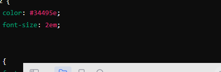
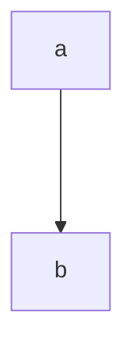

<!-- _backgroundColor: orange -->

  

# 我的演示文稿

  

---

<!-- paginate: true -->

  

## 第一张幻灯片

  

---

  


  

---


```c
（缩放图像以填充幻灯片，这也是默认图片设置
（缩放图像以适应幻灯片）
（不缩放图像，并使用原始大小）

（占据左边一半）。

```

  

---

  


  

---

  


  


  

# 欢迎报考

  

## 西北大学、西南财经大学

  

---

  


  

sss

  

---

  



  

1. asd

2. asd

  

- [ ] Task 1

- [x] Task 2

- [ ] Task 3

  

$a+b\times c=d$

  

---

  

### 第二张幻灯片

  

- 项目一

- 项目二

- 项目三

  

---

  

## 代码示例

  

```javascript

console.log('Hello, Marp!');

```

  

---

  

### 4. 预览幻灯片

  

Marp for VS Code 扩展允许你在 VS Code 中直接预览你的幻灯片。

  

1. 打开 Markdown 文件。

2. 点击右上角的预览按钮，或按 `Ctrl+K V`（Windows/Linux）或 `Cmd+K V`（macOS）打开预览窗口。

3. 你将看到以幻灯片形式呈现的 Markdown 文件内容。

  

---

  

### 5. 导出为 PDF 或 HTML

  

你可以将你的幻灯片导出为 PDF 或 HTML 格式。

  

1. 打开 Markdown 文件。

2. 点击右上角的三个点图标，然后选择 “Marp: Export Slide Deck”。

3. 选择导出格式（PDF 或 HTML）。

  

---

  

### 示例幻灯片

  

这是一个更完整的示例，展示了如何使用 Marp 创建多种类型的幻灯片：

  

```markdown

---

marp: true

theme: default

paginate: true

---