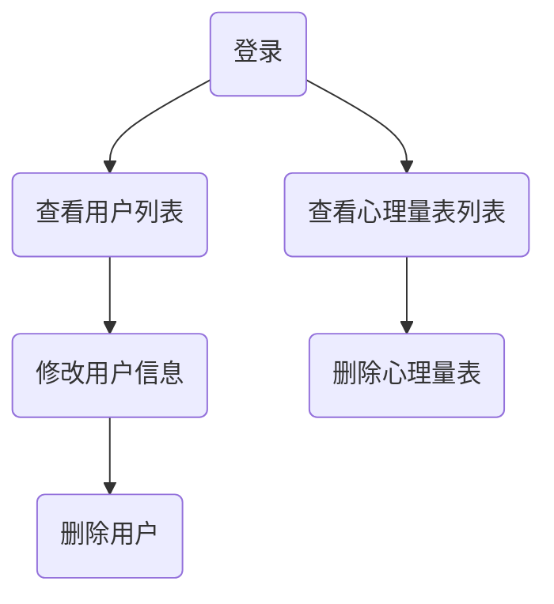

# 连线
## 连线类型
### 普通连线

> graph

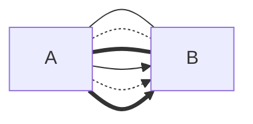

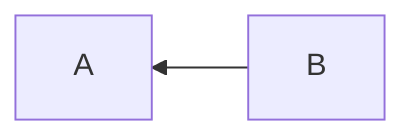

### 特殊连线

> flowchart

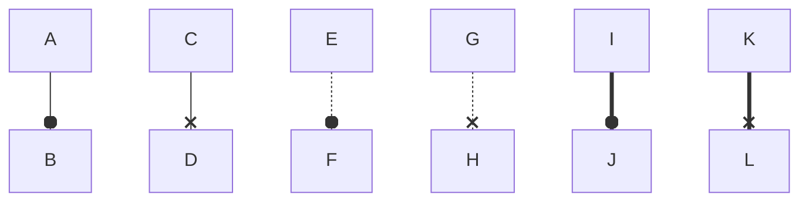

### 多向箭头

```mermaid
flowchart LR
     %% 实线
     A 0--0 B；%% 多向实线o
     C<-->D；%% 多向实线箭头
     E ×--× F；%% 多向实线x

     % 虚线
     G 0--0 H;%% 多向虚线o
     I<-->J；% 多向虚线箭头
     K ×--× L；%% 多向虚线x

     %% 粗实线
     M 0==0 N；% 多向粗实线o
     0<==>P；% 多向粗实线箭头
     R x== S；%% 多向粗实线x
```

## 连线文本
### 嵌入式

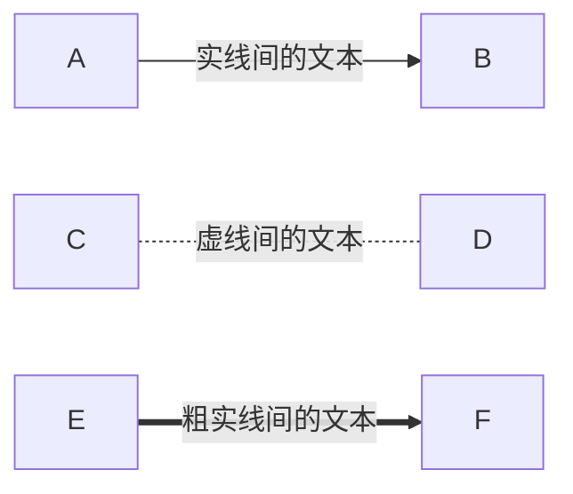

### 外部式

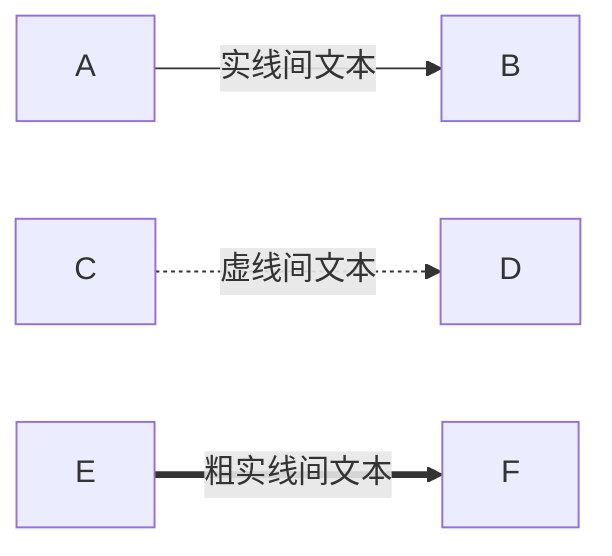

```mermaid 
graph LR 

```

## 连线形式
### 直向连线

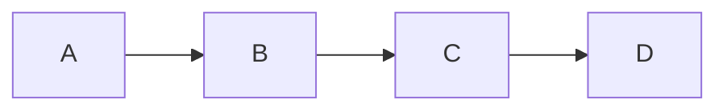

### 多重连线

> **不推荐**使用多重连线，代码不利于阅读，逻辑也不够清晰

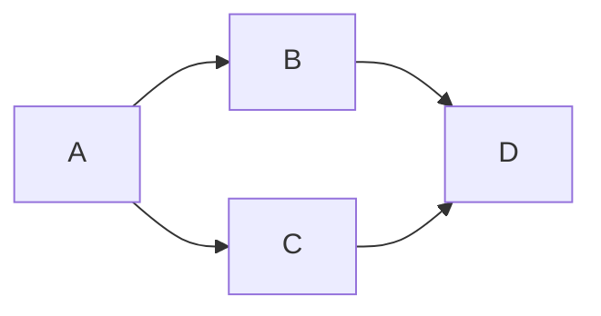

## 线条长度
### 普通线条

| 连线/长度 |  1   |   2   |   3   |
| :---: | :--: | :---: | :---: |
|  实线   | ---  | ----  | ----- |
|  虚线   | -.-  | -..-  |  -…-  |
|  粗实线  | ===  | ====  | ===== |
| 箭头实线  | -->  | --->  | ----> |
| 箭头虚线  | -.-> | -..-> | -…->  |
| 箭头粗实线 | ==>` | ===>  | ====> |

### flowchart 线条

| 连线/长度  |    1    |    2     |    3     |
| :----: | :-----: | :------: | :------: |
| 多向实线 o  | `o--o`  | `o---o`  | `o---o`  |
| 多向实线箭头 | `<-->`  | `<--->`  | `<---->` |
| 多向实线 x  | `x--x`  | `x---x`  | `x----x` |
| 多向虚线 o  | `o-.-o` | `o-..-o` | `o-…-o`  |
| 多向虚线箭头 | `<-.->` | `<-..->` | `<-…->`  |
| 多向虚线 x  | `x-.-x` | `x-..-x` | `x-…-x`  |
| 多向粗实线 o | `o==o`  | `o===o`  | `o====o` |
| 多向粗实线  | `<==>`  | `<===>`  | `<====>` |
| 多向粗实线 x | `x==x`  | `x===x`  | `x====x` |

## 节点间的多条连线
A-->|A 指向 B|B;
B-->|B 指向 A|A;

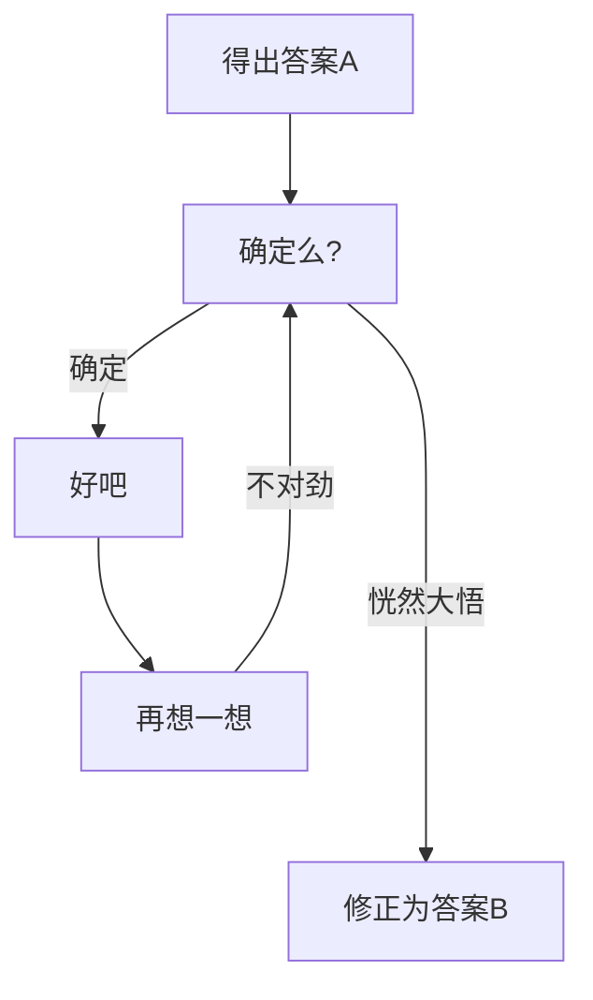

# 节点
节点，可以通俗地理解为一个**信息块**
节点由以下**三**部分组成
1. 容器 (名)
2. 文本内容
3. 形状


## 节点的容器

> 一个容器只能存储**一个文本内容**

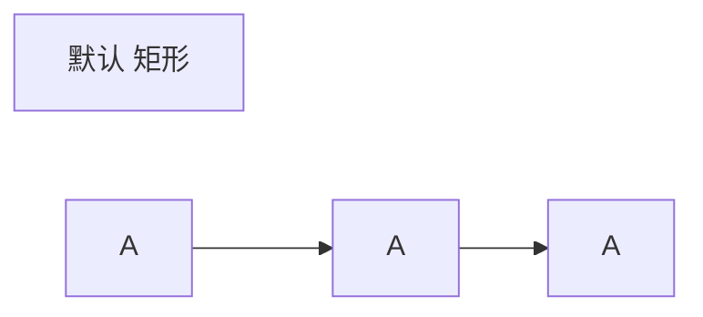

### 容器的命名规则
容器 (名) 的 命名，有一定的规则限制

1. 可以使用汉字，英文字母，数字，大部分**英文状态**下的的符号
2. **不能**使用空格
    1. 多个英文单词的容器命名，有以下**三种**方法：
        1. **驼峰命名法**
            1. 小驼峰 (第二个单词开始首字母大写)
                1. peppa==P==ig
            2. 大驼峰 (每个单词首字母都大写)
                1. ==P==eppa==P==ig
        2. **连接符**
            1. peppa==-==pig
        3. **下划线**
            1. peppa==_==pig
3. 不能使用下以下符号
    1.@ ~ < > ^ ( ) { } == " "
4. 不能使用 `end` 关键字
    1. `end` 是声明 [子图](https://publish.obsidian.md/csj-obsidian/0+-+Obsidian/Mermaid/Mermaid+%E6%B5%81%E5%9B%BE#1%20%E5%AD%90%E5%9B%BE%E5%85%B3%E9%94%AE%E5%AD%97) 的关键字，后面会讲
        1. 可以使用 **大小写**，就不会报错
            1. `End` `END`
        2. 使用 **缩写**
            1. `e` `E`

### 利用容器名精简代码

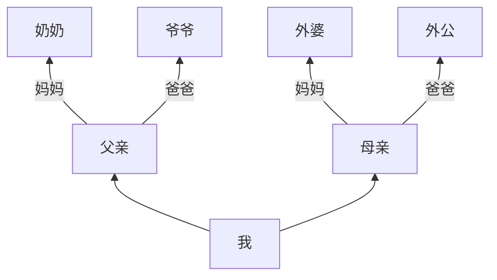

==已存入容器的文本内容，后续若要重复使用，只需要写 `容器名` 即可==

**上述代码课精简为：**


## 节点的形状
有了 `容器(名)` ，就能为节点赋予 各种形状
目前，形状一共有 **13 种**

|形状类型|代码|
|:-:|:-:|
|[矩形](https://publish.obsidian.md/csj-obsidian/0+-+Obsidian/Mermaid/Mermaid+%E6%B5%81%E5%9B%BE#2%201%20%E7%9F%A9%E5%BD%A2%20%E9%BB%98%E8%AE%A4)|`[ ]`|
|[圆形](https://publish.obsidian.md/csj-obsidian/0+-+Obsidian/Mermaid/Mermaid+%E6%B5%81%E5%9B%BE#2%202%20%E5%9C%86%E5%BD%A2)|`(( ))`|
|[菱形](https://publish.obsidian.md/csj-obsidian/0+-+Obsidian/Mermaid/Mermaid+%E6%B5%81%E5%9B%BE#2%203%20%E8%8F%B1%E5%BD%A2)|`{ }`|
|[圆角矩形](https://publish.obsidian.md/csj-obsidian/0+-+Obsidian/Mermaid/Mermaid+%E6%B5%81%E5%9B%BE#2%204%20%E5%9C%86%E8%A7%92%E7%9F%A9%E5%BD%A2)|`( )`|
|[跑道型](https://publish.obsidian.md/csj-obsidian/0+-+Obsidian/Mermaid/Mermaid+%E6%B5%81%E5%9B%BE#2%205%20%E8%B7%91%E9%81%93%E5%9E%8B)|`([ ])`|
|[平行四边形](https://publish.obsidian.md/csj-obsidian/0+-+Obsidian/Mermaid/Mermaid+%E6%B5%81%E5%9B%BE#2%206%20%E5%B9%B3%E8%A1%8C%E5%9B%9B%E8%BE%B9%E5%BD%A2)|`[/ /]`|
|[反向平行四边形](https://publish.obsidian.md/csj-obsidian/0+-+Obsidian/Mermaid/Mermaid+%E6%B5%81%E5%9B%BE#2%207%20%E5%8F%8D%E5%90%91%E5%B9%B3%E8%A1%8C%E5%9B%9B%E8%BE%B9%E5%BD%A2)|`[\ $$`|
|[六边形](https://publish.obsidian.md/csj-obsidian/0+-+Obsidian/Mermaid/Mermaid+%E6%B5%81%E5%9B%BE#2%208%20%E5%85%AD%E8%BE%B9%E5%BD%A2)|`{{ }}`|
|[梯形](https://publish.obsidian.md/csj-obsidian/0+-+Obsidian/Mermaid/Mermaid+%E6%B5%81%E5%9B%BE#2%209%20%E6%A2%AF%E5%BD%A2)|`[/ $$`|
|[倒立梯形](https://publish.obsidian.md/csj-obsidian/0+-+Obsidian/Mermaid/Mermaid+%E6%B5%81%E5%9B%BE#2%2010%20%E5%80%92%E7%AB%8B%E6%A2%AF%E5%BD%A2)|`[\ /]`|
|[燕尾型](https://publish.obsidian.md/csj-obsidian/0+-+Obsidian/Mermaid/Mermaid+%E6%B5%81%E5%9B%BE#2%2011%20%E7%87%95%E5%B0%BE%E5%9E%8B)|`> ]`|
|[子程序型](https://publish.obsidian.md/csj-obsidian/0+-+Obsidian/Mermaid/Mermaid+%E6%B5%81%E5%9B%BE#2%2012%20%E5%AD%90%E7%A8%8B%E5%BA%8F%E5%9E%8B%20%E7%BC%96%E7%A8%8B)|`[[ ]]`|
| [圆柱形](https://publish.obsidian.md/csj-obsidian/0+-+Obsidian/Mermaid/Mermaid+%E6%B5%81%E5%9B%BE#2%2013%20%E5%9C%86%E6%9F%B1%E5%BD%A2%20%E7%BC%96%E7%A8%8B) | `[( )]` |

## 文本内容
### 注意事项
节点内的文本内容，有几个需要注意的地方
1. 文本内容是**严格区分大小写**的
2. 上述提及的，*容器命名规则*中**不能**使用的 `end` 关键字，在文本内容中**允许**被使用，不会报错
3. 在文本内容输入以下 `形状` 标识符 ，会报错
	1. `[ ]` `{ }` `( )`
	2. `>` `\` `/` 可以用，不会报错
4. 一些生僻的汉字、部首，也会报错

- ? 那么，要怎样才能在文本内容中显示这些会报错的字符呢
- 可以使用，**双引号**`" "`
### 关于引号
使用双引号 `" "` 包裹，可以让破坏语法的字符，合法地进入节点，**不会**报错

```
idi["苹果(apple)爱上了桃子"];
id2("苹果[apple]爱上了桃子");
id3("苹果[apple}爱上了桃子");
id4["β"];
```

双引号 `" "` 在渲染后是不会被显示的
- ? 如何让 双引号 `" "` 作为文本内容显示出来呢？
	1. 使用单引号
	2. 利用字符实体
		1. 字符实体是 HTML 的内容
		2. 使用双引号字符实体 `&quot;`，代替一个真正的双引号
			- `id1["&quot;这里的文本被一对双引号包裹&quot;"];`
		3. 在源码中输入多个空格，仅显示**单个空格**的效果，可连续使用 `&nbsp;`
### 文本内容的换行
可以在文本内容中插入一个 `<br>元素`，代表一个换行符

### 语义化书写
对 **容器名** + **连线**，赋予**语义化**
容器名是**显式**语义化；连线是**隐式**语义化

#### 显示语义化
显式语义化，就是字面意义的语义化。之前提过，`容器名` 其实就是节点的**本体**
如果用之前举例的 ==id1, id2, id3 …… id99==，后面肯定人麻了，这类名字是**缺乏**真正语义的，我们要为容器名分个类，并为它们赋予有意义的名字

使用 `s` `e` `n` `f` `c`，**五**个**类**，作为容器名

1. `s`
    1. start (开始)。代表**开始节点**，若有多个，则用：
        1. `s1` `s2` `s3` …
2. `e`
    1. end (结束)。代表**结束节点**，若有多个，则用：
        1. `e1` `e2` `e3` …
3. `n`
    1. normal (普通)。代表**普通节点**，若有多个，则用：
        1. `n1` `n2` `n3` …
4. `f`
    1. fork (分支)。代表**分支节点**，若有多个，则用：
        1. `f1` `f2` `f3` …
5. `c`
    1. convergence (汇聚，聚合)。代表**聚合节点**，若有多个，则用：
        1. `c1` `c2` `c3` …

**注意：**

- **开始节点**一定有，**结束节点**可能无
    - 如果是闭环的，就**没有**结束节点
- 若**开始节点**出现了**分支**，则优先命名为 `s`
    - **开始节点**不可能出现**聚合**
- 若**结束节点**出现了聚合，则优先命名为 `e`
    - **结束节点**不可能出现**分支**

可以为特殊的容器名增加一些辅助说明
推荐使用下划线 `_`
- `n1_说明`

```
graph LR
%% s=start f=fork n=normal c=convergence e=end
s1[开始节点1]-->f1[分支节点1];
s2[开始节点2]-->n1[普通节点1];
s2-->n2[普通节点2];
f1-->n3[普通节点3];
f1-->n4[普通节点4];

n2-->c_重点(（"聚合节点(重点!）"))；%% 这里是重点喔
n3-->cj
n4-->c;
c-->e[结束节点];
n1-->e;
```

#### 连线的语义化
连线的语义化，是 **隐式语义化**，它不像容器那样，可以特定的英文单词表现出来，很直观
连线包括 **线 + 箭头**
- 线有 `实线` `虚线` `粗实线`
- 箭头有多向箭头 `o` `x`
线和箭头的 `语义化` 是要靠自己去理解和感受的，目的是为了凸显不同于周边的连接关系

### 节点拓展样式

可以使用 CSS，为节点增加额外的==样式==
- ! 建议不是很推荐使用拓展样式，在 [Mermaid 介绍](https://publish.obsidian.md/csj-obsidian/0+-+Obsidian/Mermaid/%E4%BB%80%E4%B9%88%E6%98%AF+Mermaid%EF%BC%9F) 中提过，**Mermaid** 就是为了在书写中实现思维的可视化，不被干扰项困扰，过多的选择会让效率大打折扣

**语法：**
- `style` 关键字，声明节点样式
- 敲一个 `空格`，输入节点 `容器(名)`，再敲一个 `空格`，然后书写==样式==
    - 样式使用 键值对 (==key:value==) 的格式书写
        - (样式)`属性:属性值`
    - 如果有多个样式，用 逗号 `,` 隔开
    - `属性1:属性值1,属性2:属性值2,属性3:属性值3`

`style 容器名 样式内容`

[#注意](https://publish.obsidian.md/#%E6%B3%A8%E6%84%8F) ==style 语句== 不能以分号 `;` 结尾，区分不同节点的样式，`Enter` 换行即可

额外的样式，主要针对节点的以下内容

**边框：**
1. 边框 线段排列
    1. `stroke-dasharray:`
        1. 把边框分割成一个个 独立的 `线段`，这里可以填两个数值
            1. `数值1` 代表 ==单个线段的长度==
            2. `数值2` 代表 ==线段与线段之间的距离==
        2. 数值之间用 `空格` 隔开
            1. `stroke-dasharray:5 10`
2. 边框**粗细** (宽度)
    1. `stroke-width:`
        1. 可以使用 `px` (像素单位)
            1. `stroke-width:2px`

**颜色：**
1. 边框**颜色**
    1. `stroke:`
2. **文本**颜色
    1. `color:`
3. **填充**颜色
    1. `fill:`

**颜色支持以下格式：**
- 英文单词
- [16进制](http://c.runoob.com/front-end/55 "可跳转至菜鸟教程了解")，

```
flowchart LR
   id1(开始)-->id2(结束);

    style id1 fill:red,stroke:#333,stroke-width:4px,color:white
       style id2 fill:yellow,stroke:#0E64BB, stroke-width:3px,color:green,stroke-dasharray:5 5
```

# 子图

子图的创建，需要**3 个**因素

1. 开始关键字
2. 字图名
3. 结束关键字

## 1 子图关键字

子图相关，推荐使用 `flowchart` 关键字
- `graph` 在部分子图中会报错

子图还需**另外两个**关键字
1. 使用 关键字 `subgraph` 声明一个子图，敲一个空格，再写**子图名**
2. 使用 关键字 `end`，代表子图的**结束**

```
flowchart 方向 
subgraph 子图名 
子图内代码; 
end;
```

## 2 子图名命名规则

- 可以使用汉字，数字，英文字母，**英文状态**下的大部分符号
- **可以**使用空格
- **不能**使用 `end` 关键字
    - `subgraph` 关键字**可以**使用
- **不能**用以下符号
    - `{` `}` `" "` `@` `[` `]` `(` `)`

```
flowchart TB
   id1(c1)-->id2((a2))

   subgraph 子图1
      % 中文+数字命名
   id3{a1}-->id2;
   end;

   subgraph subgraph2
      %%英文+数字命名
   id4([b1])-->id5{{b2}};
  end;

   subgraph subgraph 3
      %% 有空格
   id1-->id6[c2];
  end;
```

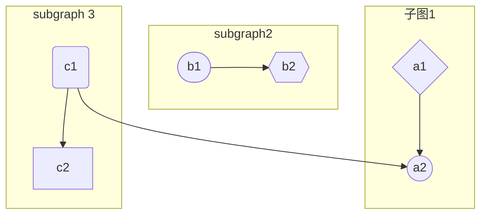

## 3 子图间的连接

子图之间也可以连接
利用 `子图名` 来连接

```
flowchart TB
   subgraph one
   a1-->a2;
   end;

   subgraph two
   b1-->b2;
   end;

   subgraph three
   c1-->c2;
   end;

      %%节点与节点的连接
      c1-->a2;

      %% 子图与子图的连接
   one-->two;
   three-->two;

      %% 子图与节点的连接
   two-->c2;
```

- ! 不过会遇到一些问题，当你子图名包含空格之类的复杂文本，会报错

==解决方法==
1. 给 `子图名` 也加一个 `容器(名)`，用一个中括号 `[ ]` ，里面放置 子图名文本
    1. 容器 推荐命名为 `sub`，如果有多个
        1. `sub1` `sub2` `sub3` …
2. 用 `容器(名)` 来连接子图

[#注意](https://publish.obsidian.md/#%E6%B3%A8%E6%84%8F) 必须用中括号 `[ ]`，其他不行，`容器名[子图名文本]`

## 4 子图的嵌套与方向

子图支持嵌套
- & 一个子图内，再塞一个子图进去
一旦子图发生了嵌套，子图内便可设置 **独立** 的方向
使用 `direction` 关键字 修改子图的方向
方向的五种写法，和 [主图的方向](#%E5%85%B3%E9%94%AE%E5%AD%97%E4%B8%8E%E6%96%B9%E5%90%91) 一样

```
flowchart LR
      subgraph 子图
      % 声明子图
      direction TB%% 子图方向
            subgraph 子图1
      direction RL %% 子图1方向
      i1-->f1
            end

      subgraph 子图2
      direction BT %% 子图2方向
      i2-->f2
            end
     end

 %% 主图
 A-->子图-->B
 子图1-->子图2
```
