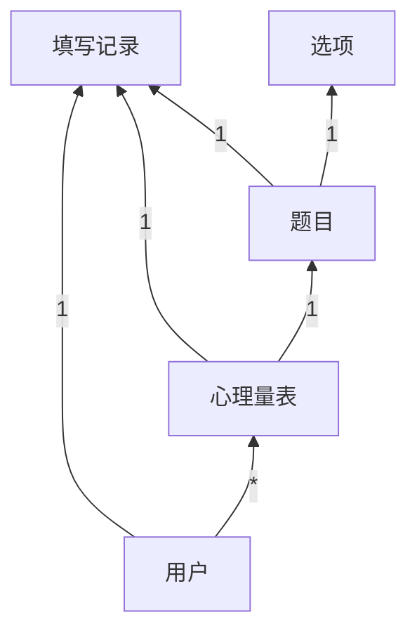
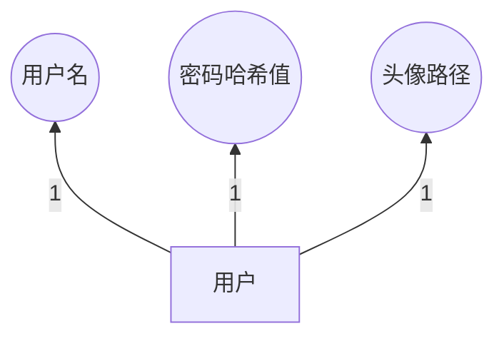
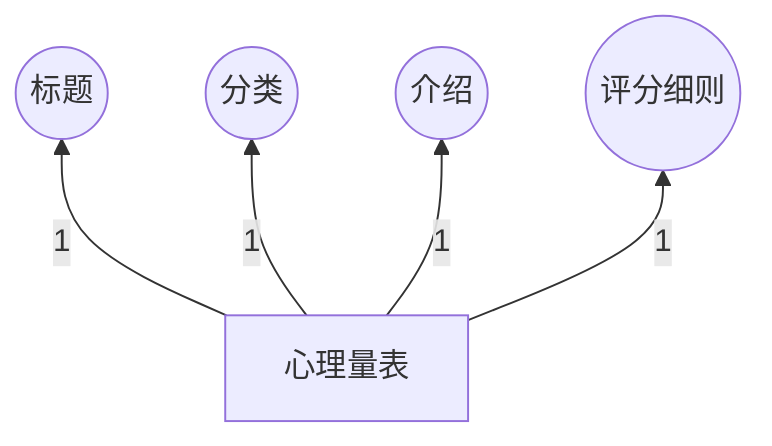
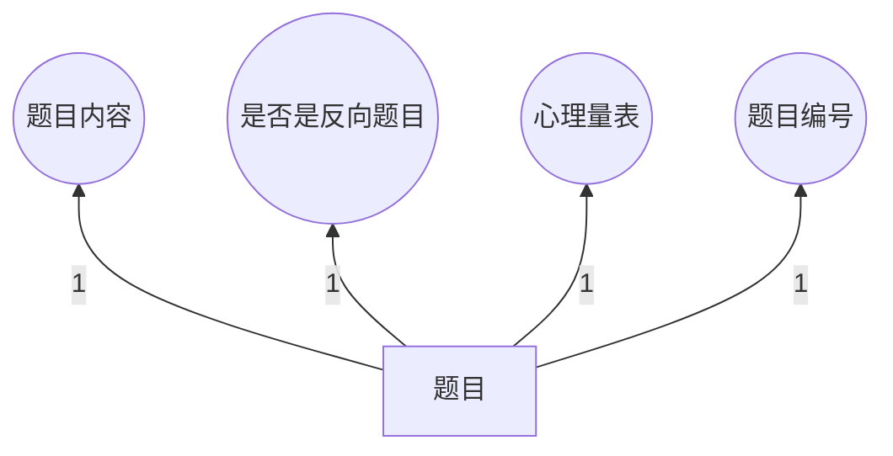
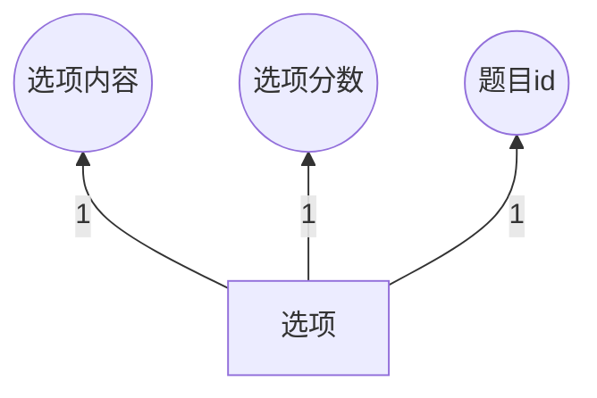
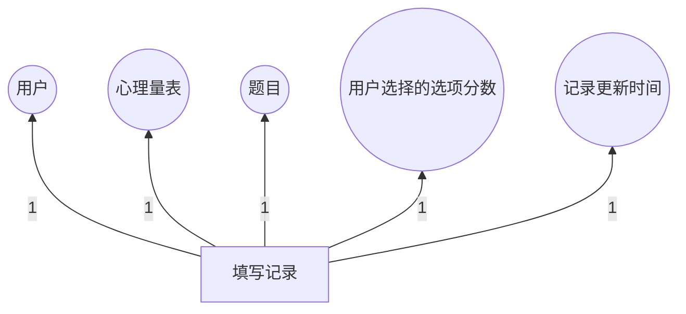
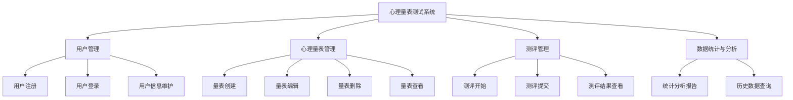
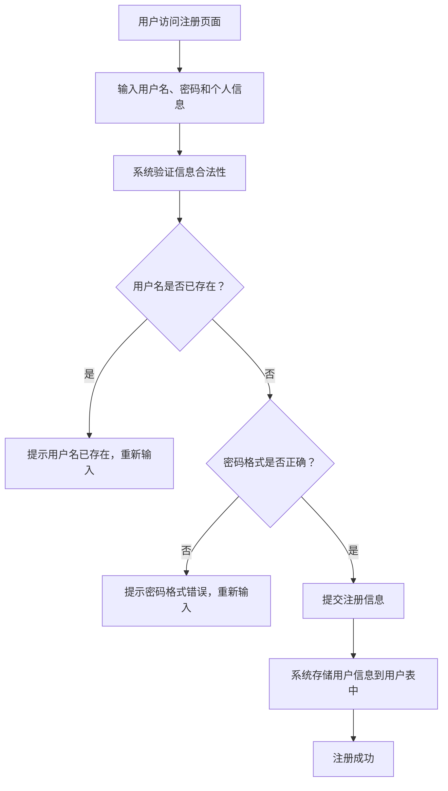
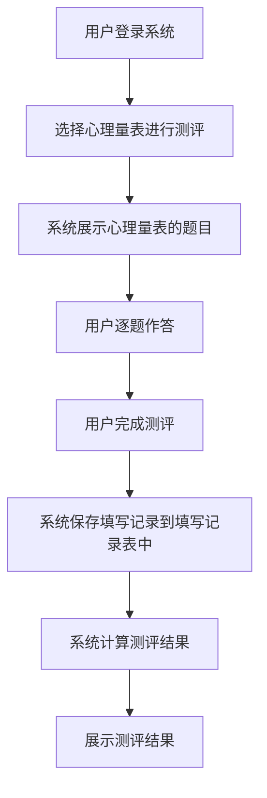
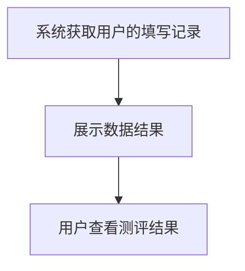

## 数据库 E-R 图

```mermaid
graph BT
  user[用户] --> |1| record[填写记录]
  psychometricScale[心理量表] --> |1| question[题目]
  question --> |1| option[选项]
  psychometricScale --> |1| record
  question --> |1| record
  user --> |*| psychometricScale

```

```mermaid
graph BT
  用户
  用户 --> |1| 用户名((用户名))
  用户 --> |1| 密码哈希值((密码哈希值))
  用户 --> |1| 头像路径((头像路径))

```

```mermaid
graph BT
  心理量表
  心理量表 --> |1| 标题((标题))
  心理量表 --> |1| 分类((分类))
  心理量表 --> |1| 介绍((介绍))
  心理量表 --> |1| 评分细则((评分细则))

```

```mermaid
graph BT
  题目
  题目 --> |1| 题目内容((题目内容))
  题目 --> |1| 是否是反向题目((是否是反向题目))
  题目 --> |1| 心理量表((心理量表))
  题目 --> |1| 题目编号((题目编号))

```

```mermaid
graph BT
  选项
  选项 --> |1| 选项内容((选项内容))
  选项 --> |1| 选项分数((选项分数))
  选项 --> |1| 题目id((题目id))

```

```mermaid
graph BT
  填写记录
  填写记录 --> |1| 用户((用户))
  填写记录 --> |1| 心理量表((心理量表))
  填写记录 --> |1| 题目((题目))
  填写记录 --> |1| 用户选择的选项分数((用户选择的选项分数))
  填写记录 --> |1| 记录更新时间((记录更新时间))

```
## 系统设计
### 功能结构设计

```mermaid
graph TB
    A[心理量表测试系统] --> B[用户管理]
    A --> C[心理量表管理]
    A --> D[测评管理]
    A --> E[数据统计与分析]

    B --> B1[用户注册]
    B --> B2[用户登录]
    B --> B3[用户信息维护]

    C --> C1[量表创建]
    C --> C2[量表编辑]
    C --> C3[量表删除]
    C --> C4[量表查看]

    D --> D1[测评开始]
    D --> D2[测评提交]
    D --> D3[测评结果查看]

    E --> E2[统计分析报告]
    E --> E3[历史数据查询]

```
### 流程图设计
#### 注册流程

```mermaid
graph TD
    A[用户访问注册页面] --> B[输入用户名、密码和个人信息]
    B --> C[系统验证信息合法性]
    C --> D{用户名是否已存在？}
    D -- 是 --> E[提示用户名已存在，重新输入]
    D -- 否 --> F{密码格式是否正确？}
    F -- 否 --> G[提示密码格式错误，重新输入]
    F -- 是 --> H[提交注册信息]
    H --> I[系统存储用户信息到用户表中]
    I --> J[注册成功]

```
#### 量表测评流程

```mermaid
graph TD
    A[用户登录系统] --> B[选择心理量表进行测评]
    B --> C[系统展示心理量表的题目]
    C --> D[用户逐题作答]
    D --> E[用户完成测评]
    E --> F[系统保存填写记录到填写记录表中]
    F --> G[系统计算测评结果]
    G --> H[展示测评结果]

```
#### 统计分析流程

```mermaid
graph TD
    A[系统获取用户的填写记录] --> B[展示数据结果]
    B --> C[用户查看测评结果]

```
